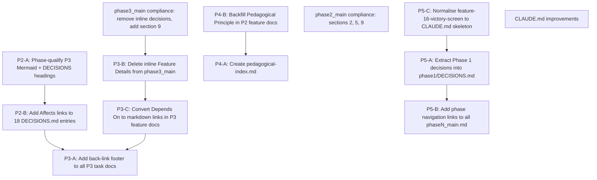

# Design System Implementation Plan

## Preamble

This plan brings the HelloIris / QuestMaster design corpus into full compliance with the conventions
established in `design/CLAUDE.md`: every phase main doc follows the nine-section template, every
feature doc carries a back-link and linked dependencies, every decision file has stable IDs and
`Affects` cross-references, and the governance file itself is extended to codify the conventions
Phase 3 introduced organically. Completing all steps yields a navigable, agent-executable design
system that a new Claude Code session can orient in under two minutes.

> **Phase qualifier notation (P3-FN)**: Because feature numbers are global and sequential across
> phases (F1 through F16 as of Phase 3), the Mermaid graph nodes and DECISIONS.md headings in
> Phase 3 are prefixed with `P3-` (e.g. `P3-F1`, `P3-C4`) so a reader can instantly tell which
> phase a node belongs to without opening a separate file. Phase 2 nodes use `P2-`, Phase 4 uses
> `P4-`. The canonical feature numbers (F1, F16, etc.) are unchanged everywhere else.

---

## Dependency Order

Steps within a group are sequenced so that each step's outputs are stable before the next step
references them. The cross-group dependency is: **P2 steps must complete before P3-A** (P3-A adds
back-links that reference DECISIONS.md entry IDs, which P2-B creates).

```
P2-A ──► P2-B ──────────────────────────────────────────────────────┐
                                                                     ▼
P3-B ──► P3-C ──► P3-A (back-links reference P2-B IDs)              │
                                                                     │
P4-B ──► P4-A (index references canonical principle names)           │
                                                                     │
P5-C ──► P5-A ──► P5-B                                              │
                                                                     │
phase2_main fixes ──────────────────────────────────────────────────┘
phase3_main fixes (after P3-B)
CLAUDE.md improvements (independent, can run last)
```

Mermaid sequence of all steps:



---

## P2 — Cross-phase lookup impairment

### Step P2-A — Phase-qualify Mermaid nodes and DECISIONS.md headings in Phase 3

**Files affected**
- `design/phase3/phase3_main.md`
- `design/phase3/DECISIONS.md`

**What to change**

*In `design/phase3/phase3_main.md` — Feature Dependency Graph section*

Replace every bare node label in the `graph TD` block with a `P3-` prefixed label. The node
variable (left of the bracket) must also change so Mermaid renders the new text. Apply this
substitution table exactly:

| Old node | New node |
|---|---|
| `C1[Remove Glossary]` | `C1[P3-C1: Remove Glossary]` |
| `F1[Dynamic Quest Regeneration]` | `F1[P3-F1: Dynamic Quest Regeneration]` |
| `F2[AI Elaborative Interrogation]` | `F2[P3-F2: AI Elaborative Interrogation]` |
| `F4[Global Tree Visualizer]` | `F4[P3-F4: Global Tree Visualizer]` |
| `F5[Unified Spiral Quests]` | `F5[P3-F5: Unified Spiral Quests]` |
| `F6[Code Prediction Quests]` | `F6[P3-F6: Code Prediction Quests]` |
| `F9[Quest Generation Indicator]` | `F9[P3-F9: Quest Generation Indicator]` |
| `F10[AI Review Modal]` | `F10[P3-F10: AI Review Modal]` |
| `F12[Branch Progression System]` | `F12[P3-F12: Branch Progression System]` |
| `F13[Skip Quest]` | `F13[P3-F13: Skip Quest]` |
| `F14[Claude API Error Feedback]` | `F14[P3-F14: Claude API Error Feedback]` |
| `F15[Tree Visualizer Filter]` | `F15[P3-F15: Tree Visualizer Filter]` |
| `C3[Navbar Navigation]` | `C3[P3-C3: Navbar Navigation]` |
| `C4[Migrate AppComponent]` | `C4[P3-C4: Migrate AppComponent]` |

Also update all edge references in the `graph TD` block so they use the same node variable names
(the left-hand side of the bracket expression — `C1`, `F1`, etc. — stays as the Mermaid variable
identifier; only the displayed label text changes).

*In `design/phase3/DECISIONS.md`*

Prefix each `###` heading with a stable decision ID in the format `D-P3-NN` (two-digit, sequential
from 01 based on document order). Replace the existing heading lines as follows. The date and
feature tag remain on the same heading line after the ID:

| Existing heading (truncated) | New heading |
|---|---|
| `### 2026-03-11: F2 — Follow-up question placed in ReviewModal` | `### D-P3-01 · 2026-03-11: P3-F2 — Follow-up question placed in ReviewModal` |
| `### 2026-03-11: C4 — AI-disabled banner Settings link uses Output event` | `### D-P3-02 · 2026-03-11: P3-C4 — AI-disabled banner Settings link uses Output event` |
| `### 2026-03-11: C4 — Standalone component test isolation` | `### D-P3-03 · 2026-03-11: P3-C4 — Standalone component test isolation` |
| `### 2026-03-11: F9 — Loading indicator scope and retry strategy` | `### D-P3-04 · 2026-03-11: P3-F9 — Loading indicator scope and retry strategy` |
| `### 2026-03-11: F4 — D3.js chosen over pure SVG` | `### D-P3-05 · 2026-03-11: P3-F4 — D3.js chosen over pure SVG` |
| `### 2026-03-11: F4 — Globals inclusion filter uses allow-list regex` | `### D-P3-06 · 2026-03-11: P3-F4 — Globals inclusion filter uses allow-list regex` |
| `### 2026-03-11: F4 — Node-count cap: 50 children per node` | `### D-P3-07 · 2026-03-11: P3-F4 — Node-count cap: 50 children per node` |
| `### 2026-03-11: F4 — UI placement is full-page /tree route` | `### D-P3-08 · 2026-03-11: P3-F4 — UI placement is full-page /tree route` |
| `### 2026-03-11: F4 — GlobalService delegates to IrisApiService` | `### D-P3-09 · 2026-03-11: P3-F4 — GlobalService delegates to IrisApiService` |
| `### 2026-03-11: F5 — GuildMember class defined by player (Option A)` | `### D-P3-10 · 2026-03-11: P3-F5 — GuildMember class defined by player (Option A)` |
| `### 2026-03-11: F5 — capstone-02 uses SQL SELECT` | `### D-P3-11 · 2026-03-11: P3-F5 — capstone-02 uses SQL SELECT` |
| `### 2026-03-11: F8 — Active time definition` | `### D-P3-12 · 2026-03-11: P3-F8 — Active time definition` |
| `### 2026-03-11: F8 — Weekly goals deferred; daily only in scope` | `### D-P3-13 · 2026-03-11: P3-F8 — Weekly goals deferred; daily only in scope` |
| `### 2026-03-11: F8 — New achievements are time-based` | `### D-P3-14 · 2026-03-11: P3-F8 — New achievements are time-based` |
| `### 2026-03-11: F8 — Goal Met indicator is ambient progress bar` | `### D-P3-15 · 2026-03-11: P3-F8 — Goal Met indicator is ambient progress bar` |
| `### 2026-03-11: F6 — Prediction quest trigger: fixed ratio` | `### D-P3-16 · 2026-03-11: P3-F6 — Prediction quest trigger: fixed ratio` |
| `### 2026-03-11: F6 — Completion flow: synthesise EvaluationResult` | `### D-P3-17 · 2026-03-11: P3-F6 — Completion flow: synthesise EvaluationResult` |
| `### 2026-03-11: F6 — Wrong answer: no retry` | `### D-P3-18 · 2026-03-11: P3-F6 — Wrong answer: no retry` |
| `### 2026-03-12: F13 — skipQuest() reads apiKey from GameStateService` | `### D-P3-19 · 2026-03-12: P3-F13 — skipQuest() reads apiKey from GameStateService` |
| `### 2026-03-12: F13 — skipsThisSession is in-memory only` | `### D-P3-20 · 2026-03-12: P3-F13 — skipsThisSession is in-memory only` |
| `### 2026-03-11: F6 — Read-only mechanism: questType check` | `### D-P3-21 · 2026-03-11: P3-F6 — Read-only mechanism: questType check` |
| `### 2026-03-16: F10 — Modal for failed quests` | `### D-P3-22 · 2026-03-16: P3-F10 — Modal for failed quests` |
| `### 2026-03-11: F4 — Test coverage: Vitest unit test for GlobalService` | `### D-P3-23 · 2026-03-11: P3-F4 — Test coverage: Vitest unit test for GlobalService` |

> Note: The original analysis counted 18 entries; a careful line-count of the actual file shows 23
> decision blocks (separated by `---`). The IDs above cover all 23. If the actual file has a
> different count, assign IDs sequentially top-to-bottom without skipping.

**Acceptance criterion**
- Every `###` heading in `design/phase3/DECISIONS.md` starts with `### D-P3-NN ·`.
- Every Mermaid node label in `phase3_main.md` graph includes the `P3-` prefix.
- The Mermaid graph still renders (no broken edge references).

---

### Step P2-B — Add `Affects` links to all entries in `phase3/DECISIONS.md`

**Files affected**
- `design/phase3/DECISIONS.md`

**What to change**

After the `**Rejected alternatives**` paragraph of each decision block, append an `**Affects**`
line that links to the relevant feature/change/bug doc(s). Use the format established in
`design/phase2/DECISIONS.md`:

```
**Affects**: [feature-NN-title.md](feature-NN-title.md)
```

Use this mapping (decision ID → file(s) to link):

| Decision ID | Affects file(s) |
|---|---|
| D-P3-01 | `feature-02-ai-elaborative-interrogation.md` |
| D-P3-02 | `change-04-migrate-app-to-quest-view.md` |
| D-P3-03 | `change-04-migrate-app-to-quest-view.md` |
| D-P3-04 | `feature-09-quest-generation-indicator.md` |
| D-P3-05 | `feature-04-global-tree-visualizer.md` |
| D-P3-06 | `feature-04-global-tree-visualizer.md` |
| D-P3-07 | `feature-04-global-tree-visualizer.md` |
| D-P3-08 | `feature-04-global-tree-visualizer.md`, `change-03-navbar-navigation.md` |
| D-P3-09 | `feature-04-global-tree-visualizer.md` |
| D-P3-10 | `feature-05-unified-spiral-quests.md` |
| D-P3-11 | `feature-05-unified-spiral-quests.md` |
| D-P3-12 | `feature-08-quest-time-tracking-goals.md` |
| D-P3-13 | `feature-08-quest-time-tracking-goals.md` |
| D-P3-14 | `feature-08-quest-time-tracking-goals.md` |
| D-P3-15 | `feature-08-quest-time-tracking-goals.md` |
| D-P3-16 | `feature-06-code-prediction-quests.md` |
| D-P3-17 | `feature-06-code-prediction-quests.md` |
| D-P3-18 | `feature-06-code-prediction-quests.md` |
| D-P3-19 | `feature-13-skip-quest.md` |
| D-P3-20 | `feature-13-skip-quest.md` |
| D-P3-21 | `feature-06-code-prediction-quests.md` |
| D-P3-22 | `feature-10-review-modal.md` |
| D-P3-23 | `feature-04-global-tree-visualizer.md` |

When a decision affects multiple files, list them comma-separated on the same line:
```
**Affects**: [feature-04-global-tree-visualizer.md](feature-04-global-tree-visualizer.md), [change-03-navbar-navigation.md](change-03-navbar-navigation.md)
```

**Acceptance criterion**
- Every decision block in `design/phase3/DECISIONS.md` ends with a non-empty `**Affects**` line.
- Every linked filename exists in `design/phase3/`.

---

## P3 — New-agent orientation

### Step P3-B — Delete the inline "Feature Details" section from `phase3_main.md`

> This step must run before P3-C and P3-A because the section being deleted contains un-linked
> "Depends On" references that would otherwise be counted as needing conversion.

**Files affected**
- `design/phase3/phase3_main.md`

**What to change**

Delete the entire section that begins with the heading `## Feature Details` and ends with the
horizontal rule `---` that immediately precedes `## Architecture Overview (Phase 3)`. Based on the
current file, this is approximately lines 97–195 (the block begins at `## Feature Details` and
contains subsections C1, F1, F2, F4, F5, F6, F9, F10, F11, C4, C3, F12, F13, F14, F16, F8).

The section to delete starts immediately after the closing `---` of the Feature Dependency Graph
section and ends immediately before `## Architecture Overview (Phase 3)`. Delete the entire block
including its `---` separator at the end.

After deletion, the document flow must be:
1. Feature Dependency Graph (with closing `---`)
2. Architecture Overview (Phase 3)

Do not touch any content before or after those boundary markers.

**Acceptance criterion**
- `design/phase3/phase3_main.md` contains no heading `## Feature Details`.
- `design/phase3/phase3_main.md` contains no subsection headings of the form `### C1:`, `### F1:`,
  etc. within a Feature Details block.
- `## Architecture Overview (Phase 3)` is still present and intact.

---

### Step P3-C — Convert plain-text `Depends On` values to markdown links in Phase 3 task docs

**Files affected** — all Phase 3 task docs that have a non-empty `Depends On` field:

| File | Current `Depends On` value |
|---|---|
| `design/phase3/feature-01-dynamic-quest-regeneration.md` | `Change 01` |
| `design/phase3/feature-02-ai-elaborative-interrogation.md` | *(check actual value)* |
| `design/phase3/feature-04-global-tree-visualizer.md` | *(check actual value)* |
| `design/phase3/feature-05-unified-spiral-quests.md` | `Feature 04, Feature 02` |
| `design/phase3/feature-06-code-prediction-quests.md` | *(check actual value)* |
| `design/phase3/feature-08-quest-time-tracking-goals.md` | *(check actual value)* |
| `design/phase3/feature-09-quest-generation-indicator.md` | *(check actual value)* |
| `design/phase3/feature-10-review-modal.md` | *(check actual value)* |
| `design/phase3/feature-12-branch-progression.md` | `Feature 01 (Dynamic Quest Regeneration)` |
| `design/phase3/feature-13-skip-quest.md` | *(check actual value)* |
| `design/phase3/feature-14-claude-api-error-feedback.md` | *(check actual value)* |
| `design/phase3/feature-15-tree-visualizer-filter.md` | *(check actual value)* |
| `design/phase3/feature-16-victory-screen.md` | *(check actual value)* |
| `design/phase3/change-02-remove-skill-tree-quest-log.md` | *(check actual value)* |
| `design/phase3/change-03-navbar-navigation.md` | *(check actual value)* |
| `design/phase3/change-04-migrate-app-to-quest-view.md` | *(check actual value)* |
| `design/phase3/bug-01-class-definition-compile.md` | *(check actual value)* |

**What to change**

For each file listed, read the header table and locate the `Depends On` row. Replace every plain
feature/change/bug reference with a markdown link. Use these link targets:

| Reference text pattern | Markdown link |
|---|---|
| `Change 01` or `C1` | `[Change 01 — Remove Glossary](change-01-remove-glossary.md)` |
| `Change 02` or `C2` | `[Change 02 — Remove Skill Tree](change-02-remove-skill-tree-quest-log.md)` |
| `Change 03` or `C3` | `[Change 03 — Navbar Navigation](change-03-navbar-navigation.md)` |
| `Change 04` or `C4` | `[Change 04 — Migrate AppComponent](change-04-migrate-app-to-quest-view.md)` |
| `Feature 01` or `F1` | `[Feature 01 — Dynamic Quest Regeneration](feature-01-dynamic-quest-regeneration.md)` |
| `Feature 02` or `F2` | `[Feature 02 — AI Elaborative Interrogation](feature-02-ai-elaborative-interrogation.md)` |
| `Feature 04` or `F4` | `[Feature 04 — Global Tree Visualizer](feature-04-global-tree-visualizer.md)` |
| `Feature 05` or `F5` | `[Feature 05 — Unified Spiral Quests](feature-05-unified-spiral-quests.md)` |
| `Feature 09` or `F9` | `[Feature 09 — Quest Generation Indicator](feature-09-quest-generation-indicator.md)` |
| `Feature 10` or `F10` | `[Feature 10 — AI Review Modal](feature-10-review-modal.md)` |
| `Feature 12` or `F12` | `[Feature 12 — Branch Progression System](feature-12-branch-progression.md)` |

If `Depends On` is already `—` (em dash), leave it unchanged.
If a file's actual `Depends On` value differs from the table above, use the actual value and apply
the same link conversion pattern.

**Acceptance criterion**
- No Phase 3 task doc has a bare feature/change number (e.g. `Feature 01`, `Change 01`) in its
  `Depends On` table cell.
- Every non-`—` `Depends On` cell contains at least one `[...](...md)` markdown link.
- All link targets resolve to files that exist in `design/phase3/`.

---

### Step P3-A — Add back-link footer to all Phase 3 task docs

> Prerequisite: P2-B must be complete (so DECISIONS.md IDs exist to reference) and P3-C must be
> complete (Depends On links are stable before the footer is added).

**Files affected** — all 20 task docs in `design/phase3/`:

```
feature-01-dynamic-quest-regeneration.md
feature-02-ai-elaborative-interrogation.md
feature-04-global-tree-visualizer.md
feature-05-unified-spiral-quests.md
feature-06-code-prediction-quests.md
feature-08-quest-time-tracking-goals.md
feature-09-quest-generation-indicator.md
feature-10-review-modal.md
feature-12-branch-progression.md
feature-13-skip-quest.md
feature-14-claude-api-error-feedback.md
feature-15-tree-visualizer-filter.md
feature-16-victory-screen.md
change-01-remove-glossary.md
change-02-remove-skill-tree-quest-log.md
change-03-navbar-navigation.md
change-04-migrate-app-to-quest-view.md
bug-01-class-definition-compile.md
```

**What to change**

Append the following footer block at the very end of each file (after the last line of existing
content). The footer must be separated from the content above by a blank line and a `---` rule.

```markdown

---

## Back-links

- Phase: [Phase 3 Main](phase3_main.md)
- Decisions: [DECISIONS.md](DECISIONS.md) — see entries tagged with this feature's ID
```

For `feature-01-dynamic-quest-regeneration.md`, the Decisions line should name the specific
decision IDs that reference F1 (none in DECISIONS.md directly — the general pointer is sufficient).
The purpose of the footer is wayfinding, not an exhaustive cross-reference, so the generic pointer
to DECISIONS.md is acceptable for all files.

**Acceptance criterion**
- Every file in the list above ends with a `## Back-links` section.
- Every `## Back-links` section contains a link to `phase3_main.md` and a link to `DECISIONS.md`.
- No existing content in any file is modified; only the footer is appended.

---

## P4 — Pedagogical coherence

### Step P4-B — Backfill `Pedagogical Principle` field in Phase 2 feature docs

> This step must run before P4-A because the index file will link back to these docs and needs the
> principle names to be canonical.

**Files affected**

All 8 Phase 2 feature docs (none currently have a `Pedagogical Principle` row in their header
table):

```
design/phase2/feature-01-class-quest-track.md
design/phase2/feature-02-ai-pair-programmer.md
design/phase2/feature-03-doc-links-hints.md
design/phase2/feature-04-challenge-mode.md
design/phase2/feature-05-concept-glossary.md
design/phase2/feature-06-unified-file-tabs.md
design/phase2/feature-07-achievement-system.md
design/phase2/feature-08-resizable-panes.md
```

**What to change**

In each file, locate the header table (the `| Field | Value |` table at the top). Insert a new row
after the `| Depends On | ... |` row:

```
| Pedagogical Principle | [value] |
```

Use these values (grounded in each feature's Design section):

| File | Pedagogical Principle value |
|---|---|
| `feature-01-class-quest-track.md` | Worked Example Effect |
| `feature-02-ai-pair-programmer.md` | Metacognition |
| `feature-03-doc-links-hints.md` | Dual Coding |
| `feature-04-challenge-mode.md` | Desirable Difficulty |
| `feature-05-concept-glossary.md` | Dual Coding |
| `feature-06-unified-file-tabs.md` | Cognitive Load Reduction |
| `feature-07-achievement-system.md` | Habit Formation |
| `feature-08-resizable-panes.md` | Cognitive Load Reduction |

**Acceptance criterion**
- Every Phase 2 feature doc has a `| Pedagogical Principle | ... |` row in its header table.
- The value is one of the canonical principle names listed above.
- No other content in any file is changed.

---

### Step P4-A — Create `design/pedagogical-index.md`

**Files affected**
- `design/pedagogical-index.md` (new file)

**What to change**

Create the file with the following structure. Each principle section must contain:
1. A one-sentence definition.
2. A source / cognitive science reference (author + concept name is sufficient — no URLs required).
3. A `Features using this principle` list with markdown links to every feature doc (across all
   phases) that uses the principle.

Use this template:

```markdown
# Pedagogical Principles Index

This index is a cross-phase entry point. Each principle links to all feature docs that apply it.
Adding a new feature? Add a row in the relevant principle section and set the `Pedagogical
Principle` field in the feature doc header table.

---

## Varied Practice

**Definition**: Presenting the same skill in different surface forms so that learning transfers
to novel situations rather than being tied to a specific stimulus-response pair.

**Source**: Schmidt & Bjork (1992) — "New Conceptualizations of Practice."

**Features using this principle**:
- [P3-F1 — Dynamic Quest Regeneration](phase3/feature-01-dynamic-quest-regeneration.md)

---

## Metacognition

**Definition**: Learning activities that require the student to reflect on their own reasoning
process, not just produce a correct output.

**Source**: Flavell (1979) — metacognitive knowledge and monitoring.

**Features using this principle**:
- [P2-F2 — AI Pair Programmer Mode](phase2/feature-02-ai-pair-programmer.md)
- [P3-F2 — AI Elaborative Interrogation](phase3/feature-02-ai-elaborative-interrogation.md)

---

## Dual Coding

**Definition**: Pairing verbal/textual information with a visual representation to create two
independent memory traces that reinforce each other.

**Source**: Paivio (1971) — dual-coding theory.

**Features using this principle**:
- [P2-F3 — Documentation Links in Hints](phase2/feature-03-doc-links-hints.md)
- [P2-F5 — Concept Glossary](phase2/feature-05-concept-glossary.md)
- [P3-F4 — Global Tree Visualizer](phase3/feature-04-global-tree-visualizer.md)

---

## Spiral Curriculum

**Definition**: Revisiting core concepts at increasing levels of abstraction and complexity across
a curriculum, so each pass deepens rather than merely repeats previous learning.

**Source**: Bruner (1960) — "The Process of Education."

**Features using this principle**:
- [P3-F5 — Unified Spiral Quests](phase3/feature-05-unified-spiral-quests.md)
- [P3-F12 — Branch Progression System](phase3/feature-12-branch-progression.md)

---

## Worked Example Effect

**Definition**: Studying a worked solution reduces cognitive load and accelerates schema
acquisition more efficiently than unsupported problem-solving for novice learners.

**Source**: Sweller & Cooper (1985) — "The Use of Worked Examples as a Substitute for
Problem Solving."

**Features using this principle**:
- [P2-F1 — Class-Based Quest Track](phase2/feature-01-class-quest-track.md)
- [P3-F6 — Code Prediction Quests](phase3/feature-06-code-prediction-quests.md)

---

## Spaced Repetition

**Definition**: Distributing practice over time with increasing inter-session intervals to exploit
the spacing effect and resist forgetting.

**Source**: Ebbinghaus (1885) / Cepeda et al. (2006) — "Distributed Practice in Verbal Recall."

**Features using this principle**:
- [P3-F8 — Quest Time Tracking & Goals](phase3/feature-08-quest-time-tracking-goals.md)

---

## Habit Formation

**Definition**: Structuring feedback and rewards to build consistent practice routines by
leveraging the cue-routine-reward loop.

**Source**: Duhigg (2012) — "The Power of Habit"; Lally et al. (2010) — habit formation research.

**Features using this principle**:
- [P2-F7 — Achievement System](phase2/feature-07-achievement-system.md)
- [P3-F8 — Quest Time Tracking & Goals](phase3/feature-08-quest-time-tracking-goals.md)

---

## Desirable Difficulty

**Definition**: Introducing challenges that slow short-term performance but enhance long-term
retention and transfer (e.g. reducing scaffolding, interleaving practice).

**Source**: Bjork (1994) — "Memory and Metamemory Considerations in the Training of Human Beings."

**Features using this principle**:
- [P2-F4 — Challenge Mode](phase2/feature-04-challenge-mode.md)

---

## Cognitive Load Reduction

**Definition**: Removing extraneous cognitive demands from the interface so that working memory
is available for the target learning material.

**Source**: Sweller (1988) — cognitive load theory.

**Features using this principle**:
- [P2-F6 — Unified File-Tab Quest Interface](phase2/feature-06-unified-file-tabs.md)
- [P2-F8 — Resizable Panes](phase2/feature-08-resizable-panes.md)
- [P3-C1 — Remove Glossary Feature](phase3/change-01-remove-glossary.md)
```

**Acceptance criterion**
- File `design/pedagogical-index.md` exists.
- It contains one section per principle listed above (9 total: Varied Practice, Metacognition,
  Dual Coding, Spiral Curriculum, Worked Example Effect, Spaced Repetition, Habit Formation,
  Desirable Difficulty, Cognitive Load Reduction).
- Every linked file path resolves relative to `design/`.
- Every Phase 2 and Phase 3 feature/change doc is referenced in at least one principle section.

---

## P5 — Structural debt

### Step P5-C — Normalise `feature-16-victory-screen.md` to the CLAUDE.md skeleton

> This step is a prerequisite for P5-A only in the sense that P5-A extracts Phase 1 decisions;
> there is no functional dependency. Run P5-C first as it is the simplest structural repair.

**Files affected**
- `design/phase3/feature-16-victory-screen.md`

**What to change**

The current file uses bespoke sections (`## Goal`, `## Trigger Condition`, `## Visual Design`,
`## Rank Table`, `## Fireworks Algorithm`, `## Component API`, `## Integration Points`,
`## Accessibility`) and lacks the standard CLAUDE.md header table and required sections.

Replace the file header and restructure to match the CLAUDE.md task doc skeleton. Preserve all
existing content — move it into the appropriate standard sections, do not delete any information.

The normalised file must have:

1. **Title line**: `# Feature 16: Victory Screen (Phase 3)` (already present — keep)

2. **Header table** with these rows (insert immediately after the title):
```markdown
| Field | Value |
|---|---|
| Priority | phase3-high |
| Status | ✅ Complete |
| Pedagogical Principle | Habit Formation |
| Depends On | [Feature 05 — Unified Spiral Quests](feature-05-unified-spiral-quests.md) |
```

3. **`## Task Prompt` section**: Write a concise description by condensing the existing `## Goal`
   and `## Trigger Condition` sections. The acceptance criteria are: overlay fires once after
   capstone-03 review is dismissed; `gameComplete()` signal drives the trigger; Continue button
   dismisses without reset. Move or remove the original `## Goal` and `## Trigger Condition`
   headings.

4. **`## Pedagogical Design` section**:
```markdown
**The Learning Problem**: Without a win condition, completing the final capstone quest produces no
closure — the player is left uncertain whether the curriculum is finished.

**The Cognitive Solution**: Habit Formation. A celebratory win-condition overlay closes the
practice loop with a clear reward signal, reinforcing the habit of completing the full curriculum
and providing closure that makes the achievement memorable.
```

5. **`## Implementation Details` section**: Retain the content currently under `## Visual Design`,
   `## Rank Table`, `## Fireworks Algorithm`, `## Component API`, and `## Integration Points` —
   consolidate them under this single heading with appropriate sub-headings (`### Visual Design`,
   `### Rank Table`, `### Fireworks Algorithm (Canvas 2D)`, `### Component API`,
   `### Integration Points`).

6. **`## Files Changed` section**: Add a placeholder:
```markdown
- `quest-master/src/app/components/victory-overlay/` — new component
- `quest-master/src/app/services/quest-engine.service.ts` — `gameComplete` computed signal
- `quest-master/src/app/components/quest-view/quest-view.component.ts` — victory trigger wiring
```

7. **`## Open Questions` section**: Add a placeholder:
```markdown
- [ ] None outstanding.
```

8. **`## Verification Plan` section**: Derive from the existing content or write:
```markdown
1. Complete capstone-01, capstone-02, and capstone-03 in sequence.
2. On dismissing the capstone-03 review modal, verify the victory overlay appears full-screen.
3. Verify the fireworks animation plays.
4. Verify the player's rank, level, and XP are displayed correctly.
5. Click Continue — verify the overlay dismisses and the normal game UI is visible.
6. Verify page reload does not re-trigger the overlay (trigger is based on `gameComplete` signal
   reading `completedQuests`, which persists; the overlay trigger is a one-shot signal).
```

9. **`## Accessibility` section**: Retain as-is (already present). Place it after Verification
   Plan.

10. **Back-links footer** (to be added by Step P3-A — do not add here to avoid double-application):
    Leave the back-link footer for Step P3-A.

**Acceptance criterion**
- `design/phase3/feature-16-victory-screen.md` contains `## Task Prompt`, `## Pedagogical Design`,
  `## Implementation Details`, `## Files Changed`, `## Open Questions`, `## Verification Plan`.
- No information present in the original file has been lost.
- The header table contains `Priority`, `Status`, `Pedagogical Principle`, and `Depends On` rows.

---

### Step P5-A — Extract Phase 1 embedded decisions into `phase1/DECISIONS.md`

**Files affected**
- `design/phase1/DECISIONS.md` (new file)
- `design/phase1/phase1_main.md` (no deletions — the inline decisions stay; only a pointer is added)

**What to change**

Read `design/phase1/phase1_main.md` in full and identify every paragraph or table row that records
a design decision, a technology choice with a rationale, or an architectural constraint. Candidates
include (but are not limited to):

- The choice of Monaco Editor over CodeMirror 6
- The "No Separate Backend" architectural constraint
- Using `fetch` instead of `HttpClient` for Claude API calls (header XSRF interference)
- Using HTTP Basic Auth for IRIS calls via `HttpHeaders` in the service
- Using `localStorage` under a single key `questmaster` for state persistence
- The XECUTE execution model (code runs as raw commands, not class methods)
- The decision to use Angular signals (not NgRx or BehaviorSubjects) for state
- The decision to call the Claude API directly from the browser (user-supplied API key)

For each identified decision, create a `D-P1-NN` entry in `design/phase1/DECISIONS.md` using this
format (consistent with Phase 2's DECISIONS.md):

```markdown
### D-P1-NN · [Date or "Phase 1 design"]: [Short title]

**Context**: [1–2 sentences describing the design situation.]

**Decision**: [What was chosen and why.]

**Rejected alternatives**: [What was not chosen and why not.]

**Affects**: [Section reference or N/A if it is an overarching constraint]

---
```

Since Phase 1 does not have individual feature docs, the `Affects` field should reference the
relevant section of `phase1_main.md` (e.g., `phase1_main.md §8.1 — ClaudeApiService`).

At the bottom of `design/phase1/phase1_main.md`, append:

```markdown

---

## Design Decisions

See [DECISIONS.md](DECISIONS.md).
```

**Acceptance criterion**
- `design/phase1/DECISIONS.md` exists with at least 6 `D-P1-NN` entries.
- Each entry follows the four-field format (Context / Decision / Rejected alternatives / Affects).
- `design/phase1/phase1_main.md` ends with a `## Design Decisions` section pointing to
  `DECISIONS.md`.

---

### Step P5-B — Add phase-to-phase navigation links at bottom of each `phaseN_main.md`

**Files affected**
- `design/phase1/phase1_main.md`
- `design/phase2/phase2_main.md`
- `design/phase3/phase3_main.md`
- `design/phase4/phase4_main.md`

**What to change**

Append a `## Phase Navigation` section at the very end of each file (after all existing content,
after any `---` rule) using these specific link blocks:

*`design/phase1/phase1_main.md`*:
```markdown

---

## Phase Navigation

- Next: [Phase 2 — Specification](../phase2/phase2_main.md)
```

*`design/phase2/phase2_main.md`*:
```markdown

---

## Phase Navigation

- Previous: [Phase 1 — Specification](../phase1/phase1_main.md)
- Next: [Phase 3 — Pedagogical Optimisation](../phase3/phase3_main.md)
```

*`design/phase3/phase3_main.md`*:
```markdown

---

## Phase Navigation

- Previous: [Phase 2 — Specification](../phase2/phase2_main.md)
- Next: [Phase 4 — Specification](../phase4/phase4_main.md)
```

*`design/phase4/phase4_main.md`*:
```markdown

---

## Phase Navigation

- Previous: [Phase 3 — Pedagogical Optimisation](../phase3/phase3_main.md)
```

> Note: `phase3_main.md` already has a `## Design Decisions` section from a prior fix. Append the
> Phase Navigation section after it.

**Acceptance criterion**
- All four `phaseN_main.md` files end with a `## Phase Navigation` section.
- Each file links to its predecessor and/or successor using relative paths (`../phaseN/`).
- No existing content is modified.

---

## Additional: `phase2_main.md` compliance gaps

### Step PH2 — Add missing sections 2, 5, and 9 to `phase2_main.md`

**Files affected**
- `design/phase2/phase2_main.md`

**What to change**

The current file is missing three mandatory sections from the CLAUDE.md nine-section template.

**Section 2 — Carry-overs from Phase 1**

Insert after the `## What Phase 1 Established` section (and its closing `---`) and before
`## Phase 2 Priority Tiers`. Content:

```markdown
## Carry-overs from Phase 1

*(Phase 1 defined no individually numbered features — it shipped the core loop as a single
monolithic deliverable. There are no feature-doc carry-overs into Phase 2.)*

---
```

**Section 5 — Phase 2 Refactorings & Decommissions**

Insert after the `## Features` table (and its closing `---`) and before
`## Feature Dependency Graph`. Content:

```markdown
## Phase 2 Refactorings & Decommissions

*(No components were decommissioned in Phase 2. The Glossary feature (F5) introduced here is later
removed in Phase 3 — see [Phase 3 — change-01-remove-glossary.md](../phase3/change-01-remove-glossary.md).)*

---
```

**Section 9 — Design Decisions**

Append at the end of the file (before the Step P5-B Phase Navigation footer, if that has already
been added). Content:

```markdown

---

## Design Decisions

See [DECISIONS.md](DECISIONS.md).
```

**Acceptance criterion**
- `design/phase2/phase2_main.md` contains a `## Carry-overs from Phase 1` section.
- `design/phase2/phase2_main.md` contains a `## Phase 2 Refactorings & Decommissions` section.
- `design/phase2/phase2_main.md` ends with a `## Design Decisions` line pointing to
  `DECISIONS.md` (before the Phase Navigation section if that has been added).

---

## Additional: `phase3_main.md` compliance gaps

### Step PH3 — Remove inline "Resolved Design Decisions" table and add section 9 to `phase3_main.md`

> Prerequisite: Step P3-B (Feature Details deletion) should run first, as both operations edit
> `phase3_main.md` and running them sequentially prevents merge conflicts.

**Files affected**
- `design/phase3/phase3_main.md`

**What to change**

**Remove the inline Resolved Design Decisions table**

Locate the section:

```markdown
## Resolved Design Decisions

| Date | Feature | Decision |
|---|---|---|
| 2026-03-11 | F12 | ... |
| 2026-03-11 | F12 + F5 | ... |
| 2026-03-11 | F12 | ... |

---
```

Delete this entire section and its trailing `---` separator. This content is already captured in
`design/phase3/DECISIONS.md` (which will have full IDs after Step P2-A completes).

**Add Section 9 — Design Decisions**

After `## Development Sequence (Phase 3)` (which is the last section in the file after P3-B
removes Feature Details), append:

```markdown

---

## Design Decisions

See [DECISIONS.md](DECISIONS.md).
```

**Acceptance criterion**
- `design/phase3/phase3_main.md` contains no `## Resolved Design Decisions` heading.
- `design/phase3/phase3_main.md` ends with a `## Design Decisions` pointer to `DECISIONS.md`
  (before the Phase Navigation section if P5-B has already been applied).

---

## Additional: CLAUDE.md governance improvements

### Step CL — Extend `design/CLAUDE.md` with five missing conventions

**Files affected**
- `design/CLAUDE.md`

**What to change**

Make the following five targeted additions to `design/CLAUDE.md`. Insert them in the locations
specified. Do not reorder existing content.

**Addition 1 — Phase field in the task doc skeleton**

In the `## When creating a new task doc` section, locate the skeleton's header table. After the
`| Depends On | — |` row, verify that `| Pedagogical Principle | ... |` already exists (it does,
per current file). Also add a `| Phase | PhaseN |` row immediately before `| Priority | ... |`:

```markdown
| Phase | PhaseN |
```

So the header table rows in order become:
`Phase` / `Priority` / `Status` / `Depends On` / `Pedagogical Principle`.

**Addition 2 — `change-NN-*` doc skeleton**

After the `## When creating a new task doc` section (which covers feature docs), add a new section:

```markdown
## When creating a new change doc

Copy this skeleton for `change-NN-*.md` files:

\`\`\`markdown
# Change NN: [Title] (PhaseN)

| Field | Value |
|---|---|
| Phase | PhaseN |
| Priority | phaseN-high / phaseN-mid / phaseN-low |
| Status | ⬜ Not started |
| Depends On | — |
| Pedagogical Principle | [e.g. Cognitive Load Reduction] |

---

## Task Prompt
[What to remove, refactor, or decommission. Include acceptance criteria.]

---

## Rationale
[Why is this change being made? What problem does it solve?]

---

## Implementation Details

- **Frontend**: ...
- **IRIS Backend**: ...

---

## Files Changed

- \`path/to/file.ts\` — [reason]

---

## Open Questions

- [ ] ...

---

## Verification Plan
1. [Step 1]
2. [Step 2]
\`\`\`

Then add a row to the Refactorings & Decommissions table in \`*_main.md\`.
```

**Addition 3 — DECISIONS.md structure definition**

After the `## When creating a new phase main doc` section, add:

```markdown
## DECISIONS.md structure

Each phase subdirectory must contain a `DECISIONS.md`. The file uses this entry format:

\`\`\`markdown
### D-PN-NN · [Date]: [Short title]

**Context**: [Situation that forced a choice.]

**Decision**: [What was chosen.]

**Rejected alternatives**: [What was not chosen and why.]

**Affects**: [feature-NN-*.md](feature-NN-*.md)

---
\`\`\`

- `D-PN-NN` — stable ID: `P` = phase, `N` = phase number, `NN` = two-digit sequential index.
- IDs are never reused or renumbered.
- The `Affects` link uses a relative path within the same phase subdirectory.
- One `DECISIONS.md` per phase; no inline decision tables in `*_main.md`.
```

**Addition 4 — Session-start checklist**

In `## When starting a new implementation session`, the current list has 6 items. After item 6,
add item 7:

```markdown
7. Glance at `DECISIONS.md` — confirm none of the architectural decisions for this feature have
   been superseded by decisions made in a later task this session.
```

**Addition 5 — Bugs section note in phase main doc template**

In `## When creating a new phase main doc`, locate the ordered section list (1 through 9). After
item 5 (`Phase N Refactorings & Decommissions`), add a note:

```markdown
   > **Optional Bugs section**: If the phase includes reactive bug fixes, add a `### Bugs` table
   > (same format as the Features table) between section 5 and section 6. Bug docs use the naming
   > convention `bug-NN-kebab-case.md` and follow the same task doc skeleton as feature docs.
```

**Acceptance criterion**
- `design/CLAUDE.md` contains a `## When creating a new change doc` section with a skeleton.
- `design/CLAUDE.md` contains a `## DECISIONS.md structure` section with the D-PN-NN format.
- The task doc skeleton header table includes a `Phase` row.
- The session-start checklist has at least 7 items.
- The phase main doc section list includes a note about the optional Bugs section.

---

## Sequence Summary

Execute steps in this order to avoid conflicts on shared files:

| Order | Step | Primary file(s) touched |
|---|---|---|
| 1 | PH3 (remove Resolved Decisions + add §9) | `phase3_main.md` |
| 2 | P3-B (delete Feature Details) | `phase3_main.md` |
| 3 | P2-A (phase-qualify Mermaid + DECISIONS headings) | `phase3_main.md`, `phase3/DECISIONS.md` |
| 4 | P2-B (add Affects links to DECISIONS) | `phase3/DECISIONS.md` |
| 5 | P3-C (convert Depends On to links) | all phase3 task docs |
| 6 | P5-C (normalise feature-16-victory-screen) | `feature-16-victory-screen.md` |
| 7 | P3-A (add back-link footer to all P3 task docs) | all phase3 task docs |
| 8 | P4-B (backfill Pedagogical Principle in P2 feature docs) | all phase2 feature docs |
| 9 | P4-A (create pedagogical-index.md) | new file |
| 10 | P5-A (extract Phase 1 decisions) | new `phase1/DECISIONS.md`, `phase1_main.md` |
| 11 | PH2 (add §2, §5, §9 to phase2_main) | `phase2_main.md` |
| 12 | P5-B (add phase navigation to all phaseN_main) | all 4 `*_main.md` files |
| 13 | CL (extend CLAUDE.md) | `design/CLAUDE.md` |

Steps 1 and 2 both edit `phase3_main.md` — run them in the order listed (1 then 2) to avoid
working on an already-modified file. Steps 5 and 7 both touch phase3 task docs — run P3-C
(step 5) before P3-A (step 7) so the Depends On links are stable before the footer is added.

---

## Total Effort Estimate

| Group | Steps | Files changed | Estimated agent turns |
|---|---|---|---|
| P2 — Cross-phase lookup | P2-A, P2-B | 2 | 2–3 |
| P3 — New-agent orientation | P3-A, P3-B, P3-C | ~20 | 3–4 |
| P4 — Pedagogical coherence | P4-A, P4-B | 9 | 2 |
| P5 — Structural debt | P5-A, P5-B, P5-C | 6 | 3 |
| phase2_main compliance | PH2 | 1 | 1 |
| phase3_main compliance | PH3 | 1 | 1 |
| CLAUDE.md improvements | CL | 1 | 1 |
| **Total** | **13** | **~40** | **~17** |

An "agent turn" is one Claude Code session executing one focused step without context overflow.
Steps that touch many files (P3-A, P3-C) may require two turns if the file list exceeds context.
