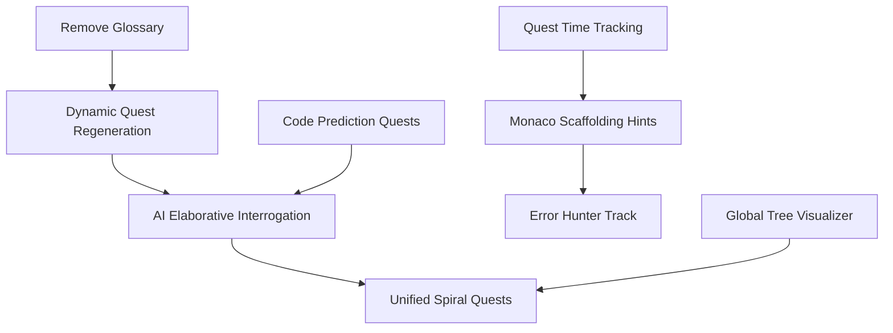

# ObjectScript Quest Master — Phase 3 Specification (Pedagogical Optimization)

> **Purpose**: This document defines Phase 3 extensions to the Quest Master app, focusing on cognitive science and advanced pedagogical techniques to accelerate the learning path for InterSystems ObjectScript.

---

## What Phase 2 Established

| Capability | Status |
|---|---|
| Class-based quest track (Atelier API integration) | ✅ |
| AI Pair Programmer (context-aware chat) | ✅ |
| Concept glossary and deep-linked documentation | ✅ (To be removed in P3) |
| Multi-file quest support (Unified File Tabs) | ✅ |
| Achievement system and resizable UI | ✅ |

**Core constraints for Phase 3:**
- Maintain "no-backend" architecture (browser + local IRIS).
- Deepen the "Mental Model" of IRIS-specific mechanics (Globals/Classes).
- Shift from "Code Production" to "Code Literacy & Metacognition."

---

## Phase 3 Priority Tiers

| Priority | Theme | Pedagogical Rationale |
|---|---|---|
| **P1 — High value, low complexity** | AI Elaborative Interrogation, Error Hunter Track | Metacognition & Productive Failure |
| **P2 — High value, medium complexity** | Global Tree Visualizer, Unified Spiral Quests | Dual Coding & Spiral Curriculum |
| **P3 — Future / High complexity** | Code Prediction Quests (Parables) | Worked Example Effect |

---

## Features

| # | Feature | Priority | Rationale | Doc |
|---|---|---|---|---|
| 1 | **Dynamic Quest Regeneration** | phase3-high | Prevents rote memorization via fresh content | [feature-01-dynamic-quest-regeneration.md](feature-01-dynamic-quest-regeneration.md) |
| 2 | **AI Elaborative Interrogation** | phase3-high | Forces "Why" vs "How" thinking | [feature-02-ai-elaborative-interrogation.md](feature-02-ai-elaborative-interrogation.md) |
| 3 | **Error Hunter Track** | phase3-high | Builds resilience to IRIS error codes | [feature-03-error-hunter-track.md](feature-03-error-hunter-track.md) |
| 4 | **Global Tree Visualizer** | phase3-mid | Visual mental model of persistent data | [feature-04-global-tree-visualizer.md](feature-04-global-tree-visualizer.md) |
| 5 | **Unified "Spiral" Quests** | phase3-mid | Bridges OO and Procedural layers | [feature-05-unified-spiral-quests.md](feature-05-unified-spiral-quests.md) |
| 6 | **Code Prediction Quests** | phase3-low | Reduces cognitive load via reading | [feature-06-code-prediction-quests.md](feature-06-code-prediction-quests.md) |
| 7 | **Monaco "Scaffolding" Hints** | phase3-high | Real-time feedback on syntax quirks | [feature-07-monaco-scaffolding-hints.md](feature-07-monaco-scaffolding-hints.md) |
| 8 | **Quest Time Tracking & Goals** | phase3-mid | Fosters habit formation and effort-based rewards | [feature-08-quest-time-tracking-goals.md](feature-08-quest-time-tracking-goals.md) |

---

## Phase 3 Refactorings & Decommissions

| # | Change | Priority | Rationale | Doc |
|---|---|---|---|---|
| C1 | **Remove Glossary Feature** | phase3-high | Simplify UI to focus on core quest loop and AI interaction | [change-01-remove-glossary.md](change-01-remove-glossary.md) |

---

## Feature Dependency Graph



---

## Feature Details

### C1: Remove Glossary Feature
Complete removal of the Glossary component, service, and data. Documentation links will move directly into the Quest hints and AI Pair Programmer context.
- **Goal**: Reduce UI clutter and cognitive overload.
- **Implementation**: Delete `glossary.component`, `glossary.service.ts`, and `glossary.ts`. Update `QuestPanel` to ensure links are still accessible via hints.

### F1: Dynamic Quest Regeneration
Ensures that pressing "Reset All Progress" triggers the AI to generate a completely new, unique set of starter and follow-up quests rather than reverting to hard-coded defaults.
- **Goal**: Encourage variation and prevent "answer-key" reliance.
- **Implementation**: Hook into `GameStateService.resetProgress()` to clear cached quest definitions and force a re-generation via `ClaudeApiService`.

### F2: AI Elaborative Interrogation
Upgrade the `ClaudeApiService` evaluation prompt. Instead of just a "Pass/Fail," Claude must ask a follow-up question that requires the user to explain a specific design choice (e.g., "Why did you use $PIECE instead of $EXTRACT here?"). 
- **Goal**: Metacognitive reinforcement.
- **Implementation**: New `evaluationResponse` model field to store the follow-up question.

### F3: Error Hunter Track
A quest series where the user is given *broken* code. The objective is not to "fix it" immediately, but to **trigger a specific IRIS error** (e.g., `<UNDEFINED>`) and then explain what caused it before fixing it.
- **Goal**: Transform "scary" legacy errors into diagnostic tools.

### F4: Global Tree Visualizer
A live-updating SVG/D3.js tree in the sidebar that shows the state of globals in the `USER` namespace.
- **Goal**: Dual Coding (Visual + Verbal).
- **Implementation**: New IRIS endpoint `/api/quest/globals` that returns a JSON representation of a global tree (limited depth).

### F5: Unified "Spiral" Quests
Advanced quests that require the user to interact with the same data via multiple paradigms: Object (Class), SQL, and Raw Global access.
- **Goal**: Break down the "magic" of IRIS persistence.
- **Example**: Create a Member object, query it with SQL, and then find the raw subscript in `^Guild.MemberD` using `$ORDER`.

### F6: Code Prediction Quests (Parables)
Quests where the editor is read-only. The user must predict the output of a complex routine or method by selecting from multiple-choice options.
- **Goal**: Build "code literacy" without the cognitive load of production.

### F7: Monaco "Scaffolding" Hints
Custom Monaco "CodeLens" or "Markers" for common ObjectScript pitfalls (e.g., "Missing space after SET," "Two spaces required after FOR").
- **Goal**: Scaffolding that fades as the user levels up.

### F8: Quest Time Tracking & Goal System
Tracks active time spent on quests and allows users to set daily and weekly goals (e.g., "30 mins/day," "4 hours/week").
- **Goal**: Spaced repetition and effort-based motivation.
- **Implementation**:
    - **Service**: New `TimeTrackingService` to measure "active" editor time.
    - **Settings**: UI for setting time goals.
    - **Achievements**: Hook into `AchievementService` to unlock rewards for "7-Day Streak" or "10 Hours Invested."

---

## Architecture Overview (Phase 3)

```
┌─────────────────────────────────────────────────────────────────────┐
│                      Browser (Angular App)                          │
│                                                                     │
│  QuestPanel (Interrogation) │  CodeEditor (Scaffolding)             │
│  AIPairChat                │  GlobalVisualizer [NEW]                │
│                                                                     │
│  ┌─────────────────────────────────────────────────────────────┐   │
│  │  Services                                                    │   │
│  │  ... + GlobalService [NEW] + ScaffoldingProvider [NEW]       │   │
│  └─────────────────────────────────────────────────────────────┘   │
└───────┬──────────────────────────────┬──────────────────────────────┘
        │                              │
        ▼                              ▼
  api.anthropic.com            localhost:52773 (IRIS)
                               ├── /api/quest/execute       
                               ├── /api/quest/compile       
                               └── /api/quest/globals [NEW]
```

---

## Development Sequence (Phase 3)

1.  **Cleanup**: Remove Glossary Feature and Tab (C1).
2.  **Dynamic Variation**: Implement Dynamic Quest Regeneration on Reset (F1).
3.  **Metacognitive Loop**: Update Claude evaluation prompts (F2).
4.  **Syntax Guardrails**: Implement Monaco syntax markers for ObjectScript quirks (F7).
5.  **Habit Formation**: Build the Quest Time Tracking & Goal System (F8).
6.  **Error Resilience**: Add "Error Hunter" starter quests (F3).
7.  **Mental Model Visualization**: Build the Global Tree Visualizer (F4).
8.  **Multi-Paradigm Mastery**: Design "Spiral" quests (F5).
