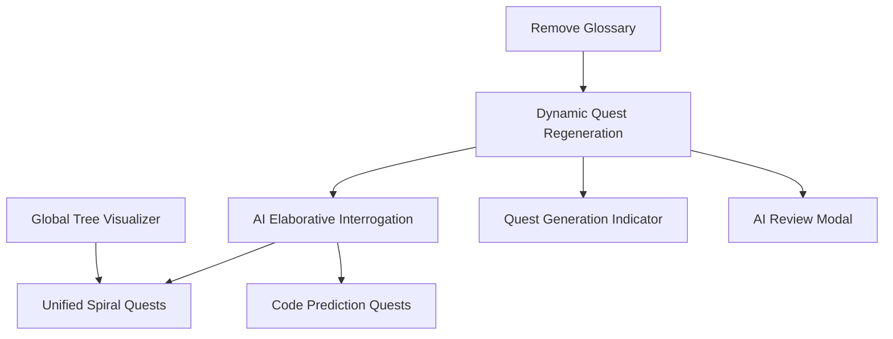

# ObjectScript Quest Master — Phase 3 Specification (Pedagogical Optimization)

> **Purpose**: This document defines Phase 3 extensions to the Quest Master app, focusing on cognitive science and advanced pedagogical techniques to accelerate the learning path for InterSystems ObjectScript.

---

## What Phase 2 Established

| Capability | Status |
|---|---|
| Class-based quest track (Atelier API integration) | ✅ |
| AI Pair Programmer (context-aware chat) | ✅ |
| Concept glossary and deep-linked documentation | ✅ (To be removed in P3) |
| Multi-file quest support (Unified File Tabs) | ✅ |
| Achievement system and resizable UI | ✅ |

**Core constraints for Phase 3:**
- Maintain "no-backend" architecture (browser + local IRIS).
- Deepen the "Mental Model" of IRIS-specific mechanics (Globals/Classes).
- Shift from "Code Production" to "Code Literacy & Metacognition."

---

## Phase 3 Priority Tiers

| Priority | Theme | Pedagogical Rationale |
|---|---|---|
| **P1 — High value, low complexity** | Dynamic Quest Regeneration, AI Elaborative Interrogation, Monaco Scaffolding Hints | Metacognition & Varied Practice |
| **P2 — High value, medium complexity** | Global Tree Visualizer, Unified Spiral Quests | Dual Coding & Spiral Curriculum |
| **P3 — Future / High complexity** | Code Prediction Quests (Parables) | Worked Example Effect |

---

## Features

| # | Feature | Priority | Rationale | Doc |
|---|---|---|---|---|
| 1 | **Dynamic Quest Regeneration** ✅ | phase3-high | Prevents rote memorization via fresh content | [feature-01-dynamic-quest-regeneration.md](feature-01-dynamic-quest-regeneration.md) |
| 2 | **AI Elaborative Interrogation** ✅ | phase3-high | Forces "Why" vs "How" thinking | [feature-02-ai-elaborative-interrogation.md](feature-02-ai-elaborative-interrogation.md) |
| 4 | **Global Tree Visualizer** | phase3-mid | Visual mental model of persistent data | [feature-04-global-tree-visualizer.md](feature-04-global-tree-visualizer.md) |
| 5 | **Unified "Spiral" Quests** | phase3-mid | Bridges OO and Procedural layers | [feature-05-unified-spiral-quests.md](feature-05-unified-spiral-quests.md) |
| 6 | **Code Prediction Quests** | phase3-low | Reduces cognitive load via reading | [feature-06-code-prediction-quests.md](feature-06-code-prediction-quests.md) |
| 7 | **Monaco "Scaffolding" Hints** | phase3-high | Real-time feedback on syntax quirks | [feature-07-monaco-scaffolding-hints.md](feature-07-monaco-scaffolding-hints.md) |
| 8 | **Quest Time Tracking & Goals** | phase3-mid | Fosters habit formation and effort-based rewards | [feature-08-quest-time-tracking-goals.md](feature-08-quest-time-tracking-goals.md) |
| 9 | **Quest Generation Loading Indicator** ✅ | phase3-high | Eliminates feedback-gap anxiety between quest completion and next quest appearing | [feature-09-quest-generation-indicator.md](feature-09-quest-generation-indicator.md) |
| 10 | **AI Review Modal** ✅ | phase3-high | Ensures players read the AI evaluation feedback before the next quest loads | [feature-10-review-modal.md](feature-10-review-modal.md) |
| 11 | **Scrollable Output Pane** ✅ | phase3-high | Prevents long output from overflowing and becoming unreadable | — |

---

## Phase 3 Refactorings & Decommissions

| # | Change | Priority | Rationale | Doc |
|---|---|---|---|---|
| C1 | **Remove Glossary Feature** ✅ | phase3-high | Simplify UI to focus on core quest loop and AI interaction | [change-01-remove-glossary.md](change-01-remove-glossary.md) |
| C2 | **Remove Skill Tree and Quest Log from Left Pane** ✅ | phase3-high | Reduce left-pane clutter; these panels add navigation overhead without contributing to the core quest-and-feedback loop | [change-02-remove-skill-tree-quest-log.md](change-02-remove-skill-tree-quest-log.md) |

---

## Feature Dependency Graph



---

## Feature Details

### C1: Remove Glossary Feature
Complete removal of the Glossary component, service, and data. Documentation links will move directly into the Quest hints and AI Pair Programmer context.
- **Goal**: Reduce UI clutter and cognitive overload.
- **Implementation**: Delete `glossary.component`, `glossary.service.ts`, and `glossary.ts`. Update `QuestPanel` to ensure links are still accessible via hints.

### F1: Dynamic Quest Regeneration
Only `quest-zero` ("Forge the Anvil") remains static. After Reset All Progress, the next quest is generated in the background by Claude while the player works through `quest-zero`.
- **Goal**: Encourage variation and prevent "answer-key" reliance.
- **Implementation**: `SettingsModal` calls `resetProgress()` then immediately fires `generateNextQuest('setup', apiKey)` as a background task (fire-and-forget).

### F2: AI Elaborative Interrogation
Upgrade the `ClaudeApiService` evaluation prompt. Instead of just a "Pass/Fail," Claude must ask a follow-up question that requires the user to explain a specific design choice (e.g., "Why did you use $PIECE instead of $EXTRACT here?"). 
- **Goal**: Metacognitive reinforcement.
- **Implementation**: New `evaluationResponse` model field to store the follow-up question.

### F4: Global Tree Visualizer
An SVG/D3.js tree in the sidebar that shows the state of globals in the `USER` namespace, refreshed each time the user clicks Run.
- **Goal**: Dual Coding (Visual + Verbal).
- **Implementation**: New IRIS endpoint `GET /api/quest/globals` returns a depth-limited JSON tree (max 3 levels, `USER` namespace only, no system globals).

### F5: Unified "Spiral" Quests
Three separate linked quests (`capstone-01/02/03`) that interact with the same `GuildMember` record via Objects, SQL, and Raw Globals respectively.
- **Goal**: Break down the "magic" of IRIS persistence.
- **Implementation**: Static quest definitions in `starter-quests.ts` chained with `prerequisites`. No Quest model changes required.

### F6: Code Prediction Quests (Parables)
AI-generated quests where the editor is read-only. The user selects the predicted output from multiple-choice options generated by Claude alongside the routine.
- **Goal**: Build "code literacy" without the cognitive load of production.
- **Implementation**: Optional `questType`, `choices`, and `correctAnswer` fields on `Quest`; graded locally without a Claude call.

### F7: Monaco "Scaffolding" Hints
Custom Monaco "CodeLens" or "Markers" for common ObjectScript pitfalls (e.g., "Missing space after SET," "Two spaces required after FOR").
- **Goal**: Scaffolding that fades as the user levels up.

### F9: Quest Generation Loading Indicator
When a quest is submitted and the AI is generating the next one, the UI currently goes silent for several seconds. This feature adds a visible progress state to the `QuestPanel` that activates immediately on quest completion and resolves once the new quest is ready.
- **Goal**: Eliminate "dead air" feedback gap and reassure the user that work is happening.
- **Implementation**: The `QuestService` exposes a `questGenerating` signal (boolean). When `generateNextQuest()` is called, the signal is set to `true`; it flips to `false` when the quest is stored. `QuestPanel` reads this signal and renders an animated loading placeholder (skeleton card or spinner with a label such as "Forging your next quest…") in place of the normal quest title/description area.

### F10: AI Review Modal
After a quest is submitted, the evaluation result (feedback, code review, XP, bonuses) is shown in a blocking modal dialog. The next quest does not load until the player explicitly dismisses the modal via the **OK** button or by pressing **Enter**. This prevents the review from being overwritten before the player finishes reading it.
- **Goal**: Force a deliberate pause so that actionable AI feedback is consumed, closing the learning loop.
- **Implementation**: New `ReviewModalComponent` with a required `evaluation` input and a `confirmed` output. `AppComponent` stores a `pendingNextQuest` closure that is only executed after `onReviewConfirmed()` is called. Enter key is handled via `@HostListener('document:keydown.enter')`.

### F11: Scrollable Output Pane
The output pane that displays IRIS execution results gets a fixed maximum height with `overflow-y: auto`, so long output (e.g., multi-line global dumps or error traces) scrolls within the pane rather than pushing other UI elements off-screen.
- **Goal**: Keep the layout stable and all output accessible regardless of output length.
- **Implementation**: Add `max-height` and `overflow-y: auto` (or equivalent Angular CDK scroll strategy) to the output pane container. Ensure the pane auto-scrolls to the bottom on new output so the latest result is always visible.

### F8: Quest Time Tracking & Goal System
Tracks active time spent on quests and allows users to set daily and weekly goals (e.g., "30 mins/day," "4 hours/week").
- **Goal**: Spaced repetition and effort-based motivation.
- **Implementation**:
    - **Service**: New `TimeTrackingService` to measure "active" editor time.
    - **Settings**: UI for setting time goals.
    - **Achievements**: Hook into `AchievementService` to unlock rewards for "7-Day Streak" or "10 Hours Invested."

---

## Architecture Overview (Phase 3)

```
┌─────────────────────────────────────────────────────────────────────┐
│                      Browser (Angular App)                          │
│                                                                     │
│  QuestPanel (Interrogation) │  CodeEditor (Scaffolding)             │
│  AIPairChat                │  GlobalVisualizer [NEW]                │
│                                                                     │
│  ┌─────────────────────────────────────────────────────────────┐   │
│  │  Services                                                    │   │
│  │  ... + GlobalService [NEW] + ScaffoldingProvider [NEW]       │   │
│  └─────────────────────────────────────────────────────────────┘   │
└───────┬──────────────────────────────┬──────────────────────────────┘
        │                              │
        ▼                              ▼
  api.anthropic.com            localhost:52773 (IRIS)
                               ├── /api/quest/execute       
                               ├── /api/quest/compile       
                               └── /api/quest/globals [NEW]
```

---

## Development Sequence (Phase 3)

1.  **Cleanup**: Remove Glossary Feature and Tab (C1).
2.  **Dynamic Variation**: Implement Dynamic Quest Regeneration on Reset (F1).
3.  **Generation Feedback**: Add Quest Generation Loading Indicator (F9).
4.  **Review Retention**: Add AI Review Modal to block next-quest load until feedback is read (F10).
5.  **Metacognitive Loop**: Update Claude evaluation prompts (F2).
6.  **Syntax Guardrails**: Implement Monaco syntax markers for ObjectScript quirks (F7).
7.  **Habit Formation**: Build the Quest Time Tracking & Goal System (F8).
8.  **Mental Model Visualization**: Build the Global Tree Visualizer (F4).
9.  **Multi-Paradigm Mastery**: Design "Spiral" capstone quests (F5).
10. **Code Literacy**: Implement Code Prediction quest type (F6).
11. **Output Usability**: Make the output pane scrollable (F11).
