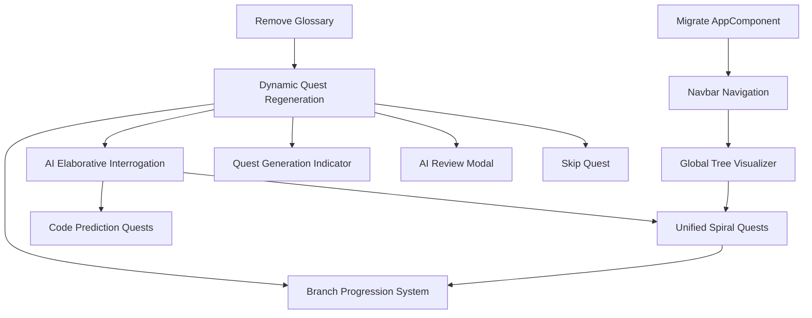

# ObjectScript Quest Master — Phase 3 Specification (Pedagogical Optimization)

> **Purpose**: This document defines Phase 3 extensions to the Quest Master app, focusing on cognitive science and advanced pedagogical techniques to accelerate the learning path for InterSystems ObjectScript.

---

## What Phase 2 Established

| Capability | Status |
|---|---|
| Class-based quest track (Atelier API integration) | ✅ |
| AI Pair Programmer (context-aware chat) | ✅ |
| Concept glossary and deep-linked documentation | ✅ (To be removed in P3) |
| Multi-file quest support (Unified File Tabs) | ✅ |
| Achievement system and resizable UI | ✅ |

**Core constraints for Phase 3:**
- Maintain "no-backend" architecture (browser + local IRIS).
- Deepen the "Mental Model" of IRIS-specific mechanics (Globals/Classes).
- Shift from "Code Production" to "Code Literacy & Metacognition."

---

## Phase 3 Priority Tiers

| Priority | Theme | Pedagogical Rationale |
|---|---|---|
| **P1 — High value, low complexity** | Dynamic Quest Regeneration, AI Elaborative Interrogation | Metacognition & Varied Practice |
| **P2 — High value, medium complexity** | Global Tree Visualizer, Unified Spiral Quests | Dual Coding & Spiral Curriculum |
| **P3 — Future / High complexity** | Code Prediction Quests (Parables) | Worked Example Effect |

---

## Features

| # | Feature | Priority | Rationale | Doc |
|---|---|---|---|---|
| 1 | **Dynamic Quest Regeneration** ✅ | phase3-high | Prevents rote memorization via fresh content | [feature-01-dynamic-quest-regeneration.md](feature-01-dynamic-quest-regeneration.md) |
| 2 | **AI Elaborative Interrogation** ✅ | phase3-high | Forces "Why" vs "How" thinking | [feature-02-ai-elaborative-interrogation.md](feature-02-ai-elaborative-interrogation.md) |
| 4 | **Global Tree Visualizer** ✅ | phase3-mid | Visual mental model of persistent data | [feature-04-global-tree-visualizer.md](feature-04-global-tree-visualizer.md) |
| 5 | **Unified "Spiral" Quests** ✅ | phase3-mid | Bridges OO and Procedural layers | [feature-05-unified-spiral-quests.md](feature-05-unified-spiral-quests.md) |
| 6 | **Code Prediction Quests** | phase3-low | Reduces cognitive load via reading | [feature-06-code-prediction-quests.md](feature-06-code-prediction-quests.md) |
| 8 | **Quest Time Tracking & Goals** ✅ | phase3-mid | Fosters habit formation and effort-based rewards | [feature-08-quest-time-tracking-goals.md](feature-08-quest-time-tracking-goals.md) |
| 9 | **Quest Generation Loading Indicator** ✅ | phase3-high | Eliminates feedback-gap anxiety between quest completion and next quest appearing | [feature-09-quest-generation-indicator.md](feature-09-quest-generation-indicator.md) |
| 10 | **AI Review Modal** ✅ | phase3-high | Ensures players read the AI evaluation feedback before the next quest loads | [feature-10-review-modal.md](feature-10-review-modal.md) |
| 11 | **Scrollable Output Pane** ✅ | phase3-high | Prevents long output from overflowing and becoming unreadable | — |
| 12 | **Branch Progression System** ✅ | phase3-mid | Automatically advances the player to new skill branches after demonstrated mastery, preventing curriculum stall on `setup` | [feature-12-branch-progression.md](feature-12-branch-progression.md) |
| 13 | **Skip Quest** | phase3-mid | Allows the player to discard a quest they find unhelpful and immediately generate a new one, preventing frustration-driven dropout | [feature-13-skip-quest.md](feature-13-skip-quest.md) |

---

## Phase 3 Refactorings & Decommissions

| # | Change | Priority | Rationale | Doc |
|---|---|---|---|---|
| C1 | **Remove Glossary Feature** ✅ | phase3-high | Simplify UI to focus on core quest loop and AI interaction | [change-01-remove-glossary.md](change-01-remove-glossary.md) |
| C2 | **Remove Skill Tree and Quest Log from Left Pane** ✅ | phase3-high | Reduce left-pane clutter; these panels add navigation overhead without contributing to the core quest-and-feedback loop | [change-02-remove-skill-tree-quest-log.md](change-02-remove-skill-tree-quest-log.md) |
| C3 | **Replace Header Bar with Slim Navbar + Navigation** ✅ | phase3-mid | Reclaim vertical space; introduce top-level navigation between Quest View and Global Tree Visualizer | [change-03-navbar-navigation.md](change-03-navbar-navigation.md) |
| C4 | **Migrate AppComponent to QuestViewComponent** ✅ | phase3-mid | Extract quest workflow into a dedicated routed component so AppComponent becomes a thin shell; prerequisite for C3 routing | [change-04-migrate-app-to-quest-view.md](change-04-migrate-app-to-quest-view.md) |

---

## Feature Dependency Graph



---

## Feature Details

### C1: Remove Glossary Feature
Complete removal of the Glossary component, service, and data. Documentation links will move directly into the Quest hints and AI Pair Programmer context.
- **Goal**: Reduce UI clutter and cognitive overload.
- **Implementation**: Delete `glossary.component`, `glossary.service.ts`, and `glossary.ts`. Update `QuestPanel` to ensure links are still accessible via hints.

### F1: Dynamic Quest Regeneration
Only `quest-zero` ("Forge the Anvil") remains static. After Reset All Progress, the next quest is generated in the background by Claude while the player works through `quest-zero`.
- **Goal**: Encourage variation and prevent "answer-key" reliance.
- **Implementation**: `SettingsModal` calls `resetProgress()` then immediately fires `generateNextQuest('setup', apiKey)` as a background task (fire-and-forget).

### F2: AI Elaborative Interrogation
Upgrade the `ClaudeApiService` evaluation prompt. Instead of just a "Pass/Fail," Claude must ask a follow-up question that requires the user to explain a specific design choice (e.g., "Why did you use $PIECE instead of $EXTRACT here?"). 
- **Goal**: Metacognitive reinforcement.
- **Implementation**: New `evaluationResponse` model field to store the follow-up question.

### F4: Global Tree Visualizer
An SVG/D3.js tree in the sidebar that shows the state of globals in the `USER` namespace, refreshed each time the user clicks Run.
- **Goal**: Dual Coding (Visual + Verbal).
- **Implementation**: New IRIS endpoint `GET /api/quest/globals` returns a depth-limited JSON tree (max 3 levels, `USER` namespace only, no system globals).

### F5: Unified "Spiral" Quests
Three separate linked quests (`capstone-01/02/03`) that interact with the same `GuildMember` record via Objects, SQL, and Raw Globals respectively.
- **Goal**: Break down the "magic" of IRIS persistence.
- **Implementation**: Static quest definitions in `starter-quests.ts` chained with `prerequisites`. No Quest model changes required.

### F6: Code Prediction Quests (Parables)
AI-generated quests where the editor is read-only. The user selects the predicted output from multiple-choice options generated by Claude alongside the routine.
- **Goal**: Build "code literacy" without the cognitive load of production.
- **Implementation**: Optional `questType`, `choices`, and `correctAnswer` fields on `Quest`; graded locally without a Claude call.

### F9: Quest Generation Loading Indicator
When a quest is submitted and the AI is generating the next one, the UI currently goes silent for several seconds. This feature adds a visible progress state to the `QuestPanel` that activates immediately on quest completion and resolves once the new quest is ready.
- **Goal**: Eliminate "dead air" feedback gap and reassure the user that work is happening.
- **Implementation**: The `QuestService` exposes a `questGenerating` signal (boolean). When `generateNextQuest()` is called, the signal is set to `true`; it flips to `false` when the quest is stored. `QuestPanel` reads this signal and renders an animated loading placeholder (skeleton card or spinner with a label such as "Forging your next quest…") in place of the normal quest title/description area.

### F10: AI Review Modal
After a quest is submitted, the evaluation result (feedback, code review, XP, bonuses) is shown in a blocking modal dialog. The next quest does not load until the player explicitly dismisses the modal via the **OK** button or by pressing **Enter**. This prevents the review from being overwritten before the player finishes reading it.
- **Goal**: Force a deliberate pause so that actionable AI feedback is consumed, closing the learning loop.
- **Implementation**: New `ReviewModalComponent` with a required `evaluation` input and a `confirmed` output. `AppComponent` stores a `pendingNextQuest` closure that is only executed after `onReviewConfirmed()` is called. Enter key is handled via `@HostListener('document:keydown.enter')`.

### F11: Scrollable Output Pane
The output pane that displays IRIS execution results gets a fixed maximum height with `overflow-y: auto`, so long output (e.g., multi-line global dumps or error traces) scrolls within the pane rather than pushing other UI elements off-screen.
- **Goal**: Keep the layout stable and all output accessible regardless of output length.
- **Implementation**: Add `max-height` and `overflow-y: auto` (or equivalent Angular CDK scroll strategy) to the output pane container. Ensure the pane auto-scrolls to the bottom on new output so the latest result is always visible.

### C4: Migrate AppComponent to QuestViewComponent
Extract all quest-workflow state, logic, and template from `AppComponent` into a new `QuestViewComponent`. After this change, `AppComponent` is a thin shell: navbar + `<router-outlet>` + `SettingsModal`. `QuestViewComponent` owns running, evaluating, and displaying quests. This is a structural prerequisite for C3 routing — C3 cannot add `<router-outlet>` until the workspace is its own component.
- **Goal**: Decouple app shell from quest workflow; enable C3's Angular Router integration.
- **Implementation**: New `QuestViewComponent` (standalone) receives all signals, methods, and child components from `AppComponent`. A `resetEpoch` signal on `QuestEngineService` handles cross-boundary state reset after Settings → Reset All Progress.

### C3: Replace Header Bar with Slim Navbar + Navigation
Replace the full-height header bar with a ~40px slim navbar. Navigation links in the centre of the navbar switch between two top-level views: **Quest View** (the existing three-pane layout) and **Tree Visualizer** (full-width, replaces the workspace). The XP bar and level badge move to the top of the quest sidebar, where they are contextually meaningful. The connection indicator and settings gear stay in the navbar and are visible in both views.
- **Goal**: Reclaim ~16px of vertical space for code; make top-level navigation explicit and extensible.
- **Implementation**: Enable Angular Router (`provideRouter`); define `/quest` and `/tree` routes; nav links use `routerLink`/`routerLinkActive`. Remove XP section from `HeaderBarComponent`; inject `GameStateService` directly into `QuestPanelComponent` for XP display. Replace `<app-quest-view>` in `app.html` with `<router-outlet />`. Introduce `UiEventService` so `QuestViewComponent` can trigger the settings modal without a direct parent binding. Ship a stub `TreeVisualizerComponent` placeholder; F4 fills it later.

### F12: Branch Progression System
After the player completes a configured number of quests in the current branch, the next `generateNextQuest` call automatically uses the next branch in the curriculum (`setup` → `commands` → `globals` → `classes` → `sql` → `capstone`). A brief toast in the Quest Panel announces the transition. The current branch is persisted in `localStorage` via `GameStateService`.

**Branch thresholds**: `setup (3)` — `commands (5)` — `globals (5)` — `classes (5)` — `sql (3)` — `capstone (null/terminal)`.
`sql` is a focused bridge paradigm (embedded SQL, dynamic queries, `%ResultSet`) before `capstone` unifies all three paradigms (OO + SQL + Raw Globals) in F5's Spiral Quests.
`quest-zero` counts toward the `setup` threshold — the player needs 2 more AI-generated `setup` quests before advancing to `commands`.

- **Goal**: Prevent curriculum stall; enforce Spiral Curriculum by introducing new ObjectScript paradigms in a controlled, mastery-gated order.
- **Implementation**: New `BRANCH_PROGRESSION` config; `QuestEngineService.resolveBranch()` counts completed quests per branch and advances when a threshold is met; `GameStateService` stores `currentBranch`; `QuestPanelComponent` renders a transient "Branch Unlocked" toast.

### F13: Skip Quest
A **Skip** button in the Quest Panel lets the player discard the current quest and immediately trigger generation of a fresh one in the same branch. Skipping is tracked as a lightweight signal (not penalised) but is surfaced in session stats so the player can reflect on patterns.
- **Goal**: Reduce frustration when a generated quest is poorly matched to the player's current context; keep engagement high without breaking the branch curriculum.
- **Implementation**: `QuestEngineService` exposes a `skipQuest()` method that discards the current quest, increments a `skipsThisSession` counter on `GameStateService`, and calls `generateNextQuest(currentBranch, apiKey)`. A confirmation guard (small inline prompt: "Skip this quest?  Skip / Cancel") prevents accidental dismissals. The Skip button is disabled while a quest is already generating (`questGenerating` signal). No XP penalty; the skipped quest does **not** count toward the branch progression threshold.

### F8: Quest Time Tracking & Goal System
Tracks active time spent on quests and allows users to set daily and weekly goals (e.g., "30 mins/day," "4 hours/week").
- **Goal**: Spaced repetition and effort-based motivation.
- **Implementation**:
    - **Service**: New `TimeTrackingService` to measure "active" editor time.
    - **Settings**: UI for setting time goals.
    - **Achievements**: Hook into `AchievementService` to unlock rewards for "7-Day Streak" or "10 Hours Invested."

---

## Architecture Overview (Phase 3)

```
┌─────────────────────────────────────────────────────────────────────┐
│                      Browser (Angular App)                          │
│                                                                     │
│  QuestPanel (Interrogation) │  CodeEditor (Scaffolding)             │
│  AIPairChat                │  GlobalVisualizer [NEW]                │
│                                                                     │
│  ┌─────────────────────────────────────────────────────────────┐   │
│  │  Services                                                    │   │
│  │  ... + GlobalService [NEW] + ScaffoldingProvider [NEW]       │   │
│  └─────────────────────────────────────────────────────────────┘   │
└───────┬──────────────────────────────┬──────────────────────────────┘
        │                              │
        ▼                              ▼
  api.anthropic.com            localhost:52773 (IRIS)
                               ├── /api/quest/execute       
                               ├── /api/quest/compile       
                               └── /api/quest/globals [NEW]
```

---

## Resolved Design Decisions

| Date | Feature | Decision |
|---|---|---|
| 2026-03-11 | F12 | `quest-zero` **counts** toward the `setup` threshold. Player needs 2 more AI-generated `setup` quests (total: 3) before advancing. |
| 2026-03-11 | F12 + F5 | Full branch sequence is `setup → commands → globals → classes → sql → capstone`. `sql` is a dedicated branch for embedded SQL, dynamic queries, and `%ResultSet` — bridging `classes` (OOP) and `capstone` (F5 Spiral Quests that unify OO + SQL + Raw Globals). |
| 2026-03-11 | F12 | `F5 → F12` dependency added to graph: F12's `BRANCH_PROGRESSION` config must include the `capstone` branch that F5's Spiral Quests inhabit. F5 must be specced before F12 can finalise quest counts for `capstone`. |

---

## Development Sequence (Phase 3)

1.  **Cleanup**: Remove Glossary Feature and Tab (C1).
2.  **Dynamic Variation**: Implement Dynamic Quest Regeneration on Reset (F1).
3.  **Generation Feedback**: Add Quest Generation Loading Indicator (F9).
4.  **Review Retention**: Add AI Review Modal to block next-quest load until feedback is read (F10).
5.  **Metacognitive Loop**: Update Claude evaluation prompts (F2).
6.  **Habit Formation**: Build the Quest Time Tracking & Goal System (F8).
8.  **AppComponent Shell**: Extract quest workflow into `QuestViewComponent`; make `AppComponent` a thin shell (C4).
9.  **Navigation Shell**: Slim navbar, Angular Router, XP-in-sidebar (C3) — ship with Tree Visualizer placeholder route.
10. **Mental Model Visualization**: Build the Global Tree Visualizer into the existing `/tree` route (F4).
11. **Multi-Paradigm Mastery**: Design "Spiral" capstone quests (F5).
12. **Code Literacy**: Implement Code Prediction quest type (F6).
13. **Output Usability**: Make the output pane scrollable (F11).
14. **Curriculum Progression**: Implement Branch Progression System so the player advances beyond `setup` (F12).
