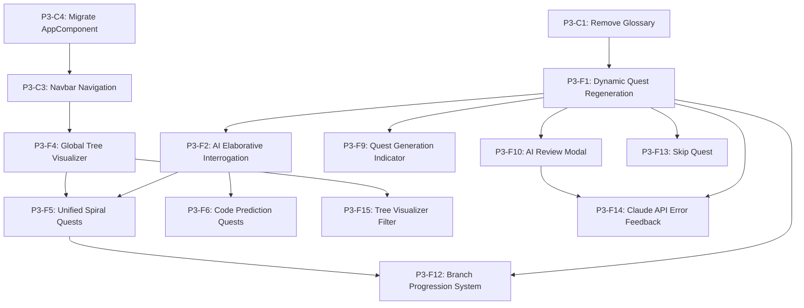

# ObjectScript Quest Master — Phase 3 Specification (Pedagogical Optimization)

> **Purpose**: This document defines Phase 3 extensions to the Quest Master app, focusing on cognitive science and advanced pedagogical techniques to accelerate the learning path for InterSystems ObjectScript.

---

## What Phase 2 Established

| Capability | Status |
|---|---|
| Class-based quest track (Atelier API integration) | ✅ |
| AI Pair Programmer (context-aware chat) | ✅ |
| Concept glossary and deep-linked documentation | ✅ (To be removed in P3) |
| Multi-file quest support (Unified File Tabs) | ✅ |
| Achievement system and resizable UI | ✅ |

**Core constraints for Phase 3:**
- Maintain "no-backend" architecture (browser + local IRIS).
- Deepen the "Mental Model" of IRIS-specific mechanics (Globals/Classes).
- Shift from "Code Production" to "Code Literacy & Metacognition."

---

## Phase 3 Priority Tiers

| Priority | Theme | Pedagogical Rationale |
|---|---|---|
| **P1 — High value, low complexity** | Dynamic Quest Regeneration, AI Elaborative Interrogation | Metacognition & Varied Practice |
| **P2 — High value, medium complexity** | Global Tree Visualizer, Unified Spiral Quests | Dual Coding & Spiral Curriculum |
| **P3 — Future / High complexity** | Code Prediction Quests (Parables) | Worked Example Effect |

---

## Features

| # | Feature | Priority | Rationale | Doc |
|---|---|---|---|---|
| 1 | **Dynamic Quest Regeneration** ✅ | phase3-high | Prevents rote memorization via fresh content | [feature-01-dynamic-quest-regeneration.md](feature-01-dynamic-quest-regeneration.md) |
| 2 | **AI Elaborative Interrogation** ✅ | phase3-high | Forces "Why" vs "How" thinking | [feature-02-ai-elaborative-interrogation.md](feature-02-ai-elaborative-interrogation.md) |
| 4 | **Global Tree Visualizer** ✅ | phase3-mid | Visual mental model of persistent data | [feature-04-global-tree-visualizer.md](feature-04-global-tree-visualizer.md) |
| 5 | **Unified "Spiral" Quests** ✅ | phase3-mid | Bridges OO and Procedural layers | [feature-05-unified-spiral-quests.md](feature-05-unified-spiral-quests.md) |
| 6 | **Code Prediction Quests** | phase3-low | Reduces cognitive load via reading | [feature-06-code-prediction-quests.md](feature-06-code-prediction-quests.md) |
| 8 | **Quest Time Tracking & Goals** ✅ | phase3-mid | Fosters habit formation and effort-based rewards | [feature-08-quest-time-tracking-goals.md](feature-08-quest-time-tracking-goals.md) |
| 9 | **Quest Generation Loading Indicator** ✅ | phase3-high | Eliminates feedback-gap anxiety between quest completion and next quest appearing | [feature-09-quest-generation-indicator.md](feature-09-quest-generation-indicator.md) |
| 10 | **AI Review Modal** ✅ | phase3-high | Ensures players read the AI evaluation feedback before the next quest loads | [feature-10-review-modal.md](feature-10-review-modal.md) |
| 11 | **Scrollable Output Pane** ✅ | phase3-high | Prevents long output from overflowing and becoming unreadable | — |
| 12 | **Branch Progression System** ✅ | phase3-mid | Automatically advances the player to new skill branches after demonstrated mastery, preventing curriculum stall on `setup` | [feature-12-branch-progression.md](feature-12-branch-progression.md) |
| 13 | **Skip Quest** ✅ | phase3-mid | Allows the player to discard a quest they find unhelpful and immediately generate a new one, preventing frustration-driven dropout | [feature-13-skip-quest.md](feature-13-skip-quest.md) |
| 14 | **Claude API Error Feedback** ✅ | phase3-high | Surfaces meaningful errors (expired key, exhausted credits, rate-limit) when `ClaudeApiService` fails instead of silently falling back to the simple evaluator | [feature-14-claude-api-error-feedback.md](feature-14-claude-api-error-feedback.md) |
| 15 | **Tree Visualizer Global Filter** ✅ | phase3-mid | Client-side filter field lets the learner narrow the tree to globals whose names match a search term; directs attention to the data just created by the current quest | [feature-15-tree-visualizer-filter.md](feature-15-tree-visualizer-filter.md) |
| 16 | **Victory Screen** ✅ | phase3-high | Full-screen win condition overlay with fireworks animation shown after all three capstone quests are completed; displays player rank, level, and total XP | [feature-16-victory-screen.md](feature-16-victory-screen.md) |

---

## Phase 3 Refactorings & Decommissions

| # | Change | Priority | Rationale | Doc |
|---|---|---|---|---|
| C1 | **Remove Glossary Feature** ✅ | phase3-high | Simplify UI to focus on core quest loop and AI interaction | [change-01-remove-glossary.md](change-01-remove-glossary.md) |
| C2 | **Remove Skill Tree and Quest Log from Left Pane** ✅ | phase3-high | Reduce left-pane clutter; these panels add navigation overhead without contributing to the core quest-and-feedback loop | [change-02-remove-skill-tree-quest-log.md](change-02-remove-skill-tree-quest-log.md) |
| C3 | **Replace Header Bar with Slim Navbar + Navigation** ✅ | phase3-mid | Reclaim vertical space; introduce top-level navigation between Quest View and Global Tree Visualizer | [change-03-navbar-navigation.md](change-03-navbar-navigation.md) |
| C4 | **Migrate AppComponent to QuestViewComponent** ✅ | phase3-mid | Extract quest workflow into a dedicated routed component so AppComponent becomes a thin shell; prerequisite for C3 routing | [change-04-migrate-app-to-quest-view.md](change-04-migrate-app-to-quest-view.md) |

---

## Bugs

| # | Bug | Priority | Description | Doc |
|---|---|---|---|---|
| B1 | **Class Definition executed as script** ✅ | phase3-high | "Run on IRIS" wraps editor content in a temp routine and calls `/execute`, so class-definition code produces `Invalid command: 'Class'`. The Class Definition tab must route to `/compile` instead. | [bug-01-class-definition-compile.md](bug-01-class-definition-compile.md) |

---

## Feature Dependency Graph



---

## Architecture Overview (Phase 3)

```
┌─────────────────────────────────────────────────────────────────────┐
│                      Browser (Angular App)                          │
│                                                                     │
│  QuestPanel (Interrogation) │  CodeEditor (Scaffolding)             │
│  AIPairChat                │  GlobalVisualizer [NEW]                │
│                                                                     │
│  ┌─────────────────────────────────────────────────────────────┐   │
│  │  Services                                                    │   │
│  │  ... + GlobalService [NEW] + ScaffoldingProvider [NEW]       │   │
│  └─────────────────────────────────────────────────────────────┘   │
└───────┬──────────────────────────────┬──────────────────────────────┘
        │                              │
        ▼                              ▼
  api.anthropic.com            localhost:52773 (IRIS)
                               ├── /api/quest/execute       
                               ├── /api/quest/compile       
                               └── /api/quest/globals [NEW]
```

---

## Development Sequence (Phase 3)

1.  **Cleanup**: Remove Glossary Feature and Tab (C1).
2.  **Dynamic Variation**: Implement Dynamic Quest Regeneration on Reset (F1).
3.  **Generation Feedback**: Add Quest Generation Loading Indicator (F9).
4.  **Review Retention**: Add AI Review Modal to block next-quest load until feedback is read (F10).
5.  **Metacognitive Loop**: Update Claude evaluation prompts (F2).
6.  **Habit Formation**: Build the Quest Time Tracking & Goal System (F8).
8.  **AppComponent Shell**: Extract quest workflow into `QuestViewComponent`; make `AppComponent` a thin shell (C4).
9.  **Navigation Shell**: Slim navbar, Angular Router, XP-in-sidebar (C3) — ship with Tree Visualizer placeholder route.
10. **Mental Model Visualization**: Build the Global Tree Visualizer into the existing `/tree` route (F4).
11. **Multi-Paradigm Mastery**: Design "Spiral" capstone quests (F5).
12. **Code Literacy**: Implement Code Prediction quest type (F6).
13. **Output Usability**: Make the output pane scrollable (F11).
14. **Curriculum Progression**: Implement Branch Progression System so the player advances beyond `setup` (F12).
15. **API Error Visibility**: Surface Claude API failures (invalid key, exhausted credits, rate-limit) with typed errors and an inline UI warning (F14).
16. **Tree Visualizer Filter**: Add client-side filter input to Tree Visualizer; remove total node cap from backend (F15).

---

## Design Decisions

See [DECISIONS.md](DECISIONS.md).


---

## Phase Navigation

- Previous: [Phase 2 — Specification](../phase2/phase2_main.md)
- Next: [Phase 4 — Specification](../phase4/phase4_main.md)
