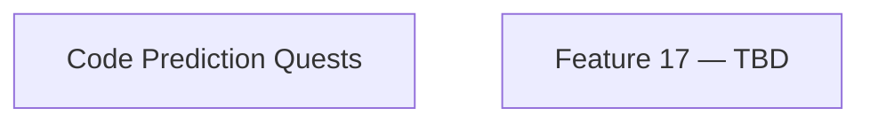

# ObjectScript Quest Master — Phase 4 Specification

> **Purpose**: This document defines Phase 4 extensions. Phase 4 follows the pedagogical foundation laid in Phase 3 and focuses on [TBD — describe the phase theme here, e.g. "player retention, social features, advanced curriculum"].

---

## Phase 3 Retrospective

| Architectural Change | Impact on Phase 4 |
|---|---|
| Angular Router + `QuestViewComponent` shell | New views can be added as routes without touching `AppComponent` |
| Branch Progression System | Phase 4 features must respect `currentBranch` signal from `GameStateService` |
| `ClaudeApiError` typed errors | All new AI calls must handle the typed error and surface UI feedback |
| Global Tree Visualizer on `/tree` route | Extensible — can add filters, depth controls, or history replay |

---

## Carry-overs from Phase 3

| # | Feature | Original Priority | Reason Deferred | Doc |
|---|---|---|---|---|
| 6 | **Code Prediction Quests** | phase3-low | Complexity; AI multiple-choice generation not yet stable | [feature-06-code-prediction-quests.md](../phase3/feature-06-code-prediction-quests.md) |

---

## Phase 4 Priority Tiers

| Priority | Theme | Pedagogical Rationale |
|---|---|---|
| **P1 — High value, low complexity** | [TBD] | |
| **P2 — High value, medium complexity** | [TBD] | |
| **P3 — Future / High complexity** | [TBD] | |

---

## Features

| # | Feature | Priority | Rationale | Doc |
|---|---|---|---|---|
| 6 | **Code Prediction Quests** *(carry-over)* | phase4-high | Completes the "code literacy" track started in P3 | [feature-06-code-prediction-quests.md](../phase3/feature-06-code-prediction-quests.md) |
| 17 | [Feature title] | phase4-high | | [feature-17-*.md](feature-17-*.md) |

> Feature numbers continue from Phase 3 (last used: F16). Next available: **F17**.

---

## Phase 4 Refactorings & Decommissions

| # | Change | Priority | Rationale | Doc |
|---|---|---|---|---|
| — | *(none planned yet)* | — | — | — |

---

## Feature Dependency Graph



---

## Architecture Overview (Phase 4)

> Update this diagram as new endpoints or services are introduced.

```
┌─────────────────────────────────────────────────────────────────────┐
│                      Browser (Angular App)                          │
│                                                                     │
│  QuestView (/quest)  │  TreeVisualizer (/tree)  │  [new routes]     │
│                                                                     │
│  ┌─────────────────────────────────────────────────────────────┐   │
│  │  Services (Phase 3 baseline)                                 │   │
│  │  QuestEngineService · GameStateService · ClaudeApiService    │   │
│  │  TimeTrackingService · GlobalService                         │   │
│  │  + [new Phase 4 services here]                               │   │
│  └─────────────────────────────────────────────────────────────┘   │
└───────┬──────────────────────────────┬──────────────────────────────┘
        │                              │
        ▼                              ▼
  api.anthropic.com            localhost:52773 (IRIS)
                               ├── /api/quest/execute
                               ├── /api/quest/compile
                               └── /api/quest/globals
```

---

## Development Sequence (Phase 4)

1. **Carry-over**: Complete Code Prediction Quests (F6).
2. [Next step — TBD]

---

## Design Decisions

See [DECISIONS.md](DECISIONS.md) for all architectural forks and rejected alternatives.


---

## Phase Navigation

- Previous: [Phase 3 — Pedagogical Optimisation](../phase3/phase3_main.md)
