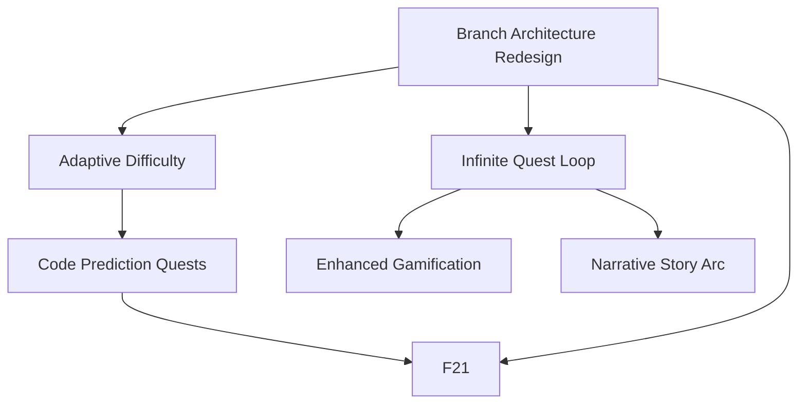

# ObjectScript Quest Master — Phase 4 Specification

> **Purpose**: Phase 4 focuses on **long-term engagement and learning depth** — making the game infinite, progressively harder, and more rewarding over time. It addresses curriculum gaps identified after completing Phase 3, and explores structural changes to the branch/quest architecture.

---

## Phase 3 Retrospective

| Architectural Change | Impact on Phase 4 |
|---|---|
| Angular Router + `QuestViewComponent` shell | New views can be added as routes without touching `AppComponent` |
| Branch Progression System | Phase 4 must either extend or replace `currentBranch` signal from `GameStateService` |
| Victory Screen (F16) on 21-quest finish | Game currently ends — Phase 4 must redefine the "end state" entirely |
| `ClaudeApiError` typed errors | All new AI calls must handle typed errors and surface UI feedback |
| Global Tree Visualizer on `/tree` route | Extensible — can add filters, depth controls, or history replay |

---

## Carry-overs from Phase 3

| # | Feature | Original Priority | Reason Deferred | Doc |
|---|---|---|---|---|
| 6 | **Code Prediction Quests** | phase3-low | Complexity; AI multiple-choice generation not yet stable | [feature-06-code-prediction-quests.md](../phase3/feature-06-code-prediction-quests.md) | ✅ Complete |

---

## Open Design Questions (Phase 4 Scope)

These are the primary topics requiring discussion and decision before full feature specs can be written.

### Q1 — Infinite Game: How should the game continue after 21 quests?

**Problem**: The game currently ends after 5 branches × ~4 quests + 1 capstone = ~21 quests. This is too short for meaningful skill acquisition.

**Options under consideration**:
1. **Endless branch loops** — after completing all branches, cycle them again with higher difficulty parameters fed into the AI prompt. Each "lap" = a new difficulty tier.
2. **Prestige / New Game+** — Victory Screen stays, then offers a "Play Again — Harder" button that resets quest count but increases an internal difficulty level stored in `GameStateService`.
3. **Dynamic branch extension** — branches never have a fixed quest count; the AI decides when mastery is sufficient (via evaluation score threshold). The player is never told how many quests remain in a branch.
4. **Infinite side-quests** — after completing the main curriculum, unlock a free-practice mode with no branch structure, just topic-tagged quests on demand.

**Decision**: **Option 2 — Prestige / New Game+** with free-practice mode as a post-Prestige unlock. See [DECISIONS.md → D-P4-01](DECISIONS.md) and [q1-infinite-game-analysis.md](q1-infinite-game-analysis.md).

---

### Q2 — Narrative Story Arc: Should quests be embedded in a story?

**Problem**: Quests currently feel isolated. A thin narrative layer could increase motivation and give context to otherwise abstract exercises.

**Options under consideration**:
1. **Frame narrative** — A fictional "mission" (e.g., "You are a new IRIS developer at MedCorp tasked with migrating a legacy database"). Each branch = a chapter. The story is surface-level flavor text in the quest header.
2. **Story-driven quest titles** — AI is prompted to name quests as story episodes ("Chapter 3, Mission 2: Fix the patient record lookup"). No structural change to quests.
3. **Progressive world-building** — Completing quests "unlocks" lore entries about the fictional world, stored in a side panel. Low pedagogical value but high engagement signal.
4. **No story** — Keep the tool lean and professional. Story may feel childish for developers.

**Decision**: **Option 2 — Story-driven quest titles.** The AI prompt names each quest as a story episode ("Chapter 2, Mission 3: Retrieve the Missing Patient Records"). No structural changes. Register must be dry and enterprise-contextual. See [DECISIONS.md → D-P4-02](DECISIONS.md) and the supporting analyses: [UX Research](q2-narrative-arc-ux-research.md) · [Behavioral Nudge Engine](q2-narrative-arc-behavioral-nudge.md).

---

### Q3 — Adaptive Difficulty: How should quest complexity scale with player level?

**Problem**: Phase 3 quests start simple and get harder per branch, but difficulty does not adapt to individual player performance. A skilled developer gets the same easy early quests as a beginner.

**Options under consideration**:
1. **Level-gated AI prompts** — `QuestEngineService` passes current XP level to the Claude prompt as a difficulty hint. Low cost, already partially supported.
2. **Score-based adaptation** — If the player completes 3 quests in a row with a perfect AI evaluation score, the next quest is generated at +1 difficulty tier. If they fail 2 in a row, drop a tier.
3. **Initial skill assessment** — First session: 3-5 diagnostic quests. Based on results, skip early branches.
4. **Manual difficulty toggle** — Player sets their own difficulty (Beginner / Intermediate / Advanced) before starting. Simple, respects player autonomy.

**Decision**: **Option 4 + Option 1 as the execution layer.** A manual difficulty toggle (Beginner / Intermediate / Advanced) at first session sets the starting tier and initial branch; level-gated AI prompting handles continuous progression within that band. Options 2 and 3 are deferred until the scoring substrate and branch architecture are more mature. See [DECISIONS.md → D-P4-03](DECISIONS.md) and the supporting analysis: [Game Designer](q3-adaptive-difficulty-game-designer.md).

---

### Q4 — Branch Architecture: Is the current branch system the right structure?

**Problem**: The current branch system (setup → globals → classes → sql → capstone) is linear and fixed. After completing Phase 3 the user felt 5 quests per branch (especially classes and SQL) was insufficient.

**Options under consideration**:
1. **Increase quest count per branch** — Simple fix: raise the quest threshold in `GameStateService` from 5 to 8–10 for complex branches (classes, SQL).
2. **Variable-length branches** — Each branch has a minimum quest count (e.g., 4) but runs until a mastery score threshold is met, not a fixed number.
3. **Sub-branches** — Classes splits into: Properties → Methods → Inheritance → Relationships. SQL splits into: Queries → Joins → Aggregation → Embedded SQL. Each sub-branch = its own mini-track.
4. **Topic tags instead of branches** — Remove the branch concept entirely. Every quest has topic tags (globals, classes, SQL, etc.). The engine selects topics using a weighted probability that ensures coverage and spiraling. More flexible but harder to visualize progress.
5. **Parallel tracks** — Player chooses a track (e.g., "Data-focused" or "OOP-focused") at start. Both tracks cover all topics but weight them differently.

**Decision**: **Option 3 — Sub-branches.** Classes splits into Properties → Methods → Inheritance → Relationships; SQL splits into Queries → Joins → Aggregation → Embedded SQL (3–4 quests per sub-branch). Total curriculum grows to ~41 quests minimum. A bridge fix raises Classes to 8 and SQL to 6 quests in `minQuestsToAdvance` while C5 is implemented. See [DECISIONS.md → D-P4-04](DECISIONS.md) and the supporting analyses: [Game Designer](q4-branch-architecture-game-designer.md) · [UX Research](q4-branch-architecture-ux-research.md).

---

### Q5 — Code Prediction Frequency: Should Code Prediction quests appear more often?

**Problem**: Code Prediction quests (F6, carry-over from Phase 3) are not yet implemented. Once implemented, the user expects them to appear more often than the current design implies (one type among many, rarely triggered).

**Options under consideration**:
1. **Guaranteed ratio** — Every Nth quest (e.g., every 3rd) is forced to be a Code Prediction quest, regardless of branch.
2. **Branch-specific weighting** — Code Prediction quests are more frequent in classes and SQL branches where "reading code" is especially important for understanding.
3. **Post-failure trigger** — After a failed submission, the next quest is automatically a Code Prediction quest on the same topic (reduces cognitive load, scaffolds recovery).
4. **Player toggle** — Player can opt into "more reading quests" mode in settings.

**Decision**: **Option 3 (post-failure trigger) as mandatory baseline + Option 2 (branch-specific weighting) as ambient layer + Option 1 (guaranteed ratio) as minimum-frequency floor only (1-in-5). Option 4 (player toggle) deferred — replaced by an in-quest continuation/exit choice after each prediction quest.** See [DECISIONS.md → D-P4-05](DECISIONS.md) and the supporting analyses: [Behavioral Nudge Engine](q5-code-prediction-frequency-behavioral-nudge.md) · [Game Designer](q5-code-prediction-frequency-game-designer.md).

---

### Q6 — Gamification: What engagement mechanics should be added?

**Research direction**: Before designing new features, evaluate what works in comparable tools.

**Comparable products to research**:
- **Duolingo** — streaks, hearts (lives system), XP leagues, daily goals, friend competition
- **Codecademy** — progress bars, badges, project-based certificates
- **Exercism** — mentored tracks, reputation, community solutions
- **Codewars** — honor system, kyu/dan ranks, kata difficulty ratings, solution discussion
- **Zed / Vim adventure** — flow-state design, no interruptions
- **HackerRank** — timed challenges, leaderboards, skill certifications

**Gamification mechanics worth evaluating**:
| Mechanic | Likely Benefit | Risk |
|---|---|---|
| Daily streak tracking | Habit formation | Punishes busy learners |
| Lives / failure cost | Stakes raise engagement | Frustration-driven dropout |
| XP leagues / leaderboards | Social motivation | No multiplayer currently |
| Unlockable cosmetics (themes) | Low-cost engagement boost | Dev overhead |
| "Combo" bonus XP | Rewards flow state | Trivial to game |
| Timed challenge mode | Tests under pressure | Anxiety for some learners |
| Certificate / graduation | Completion motivation | Needs curriculum definition |
| Boss quests (harder, named) | Narrative structure | AI prompt complexity |
| Hint system (costs XP) | Reduces rage-quit | May reduce learning depth |

**Decision**: **Boss Quests + Hint System (XP cost) + Unlockable Cosmetics.** Both independent analyses converged on the same three mechanics. Boss Quests provide intrinsic mastery milestones at branch climaxes and integrate with D-P4-01 (Prestige re-generates them at higher difficulty) and D-P4-02 (story titles frame them as chapter climaxes). The Hint System is dropout prevention, not accessibility aid — an XP-cost trade-off that preserves autonomy while ensuring learners always have a path forward. Unlockable Cosmetics (branch-themed editor themes) carry zero punishment risk and provide goal-gradient milestone signaling. All mechanics that punish breaks (streaks, lives) and all mechanics requiring a multiplayer population (leaderboards) are rejected. Timed mode and Certificates are deferred. See the supporting analyses: [UX Research](q6-gamification-ux-research.md) · [Behavioral Nudge Engine](q6-gamification-behavioral-nudge.md).

---

## Phase 4 Priority Tiers

| Priority | Theme | Pedagogical Rationale |
|---|---|---|
| **P1 — High value, low complexity** | Infinite game loop + Code Prediction (F6) | Retention requires both content volume and reading practice |
| **P2 — High value, medium complexity** | Adaptive difficulty + Branch depth expansion | Differentiation and mastery — prevents boredom and frustration |
| **P3 — Future / High complexity** | Narrative arc + Branch architecture redesign + Gamification systems | High engagement value but significant design and dev cost |

---

## Features

| # | Feature | Priority | Status | Rationale | Doc |
|---|---|---|---|---|---|
| 6 | **Code Prediction Quests** *(carry-over)* | phase4-high | ✅ Complete | Completes the "code literacy" track; should appear more frequently (see Q5) | [feature-06-code-prediction-quests.md](../phase3/feature-06-code-prediction-quests.md) |
| 17 | **Infinite Quest Loop** | phase4-high | ✅ Complete | Game ends after 21 quests; must support indefinite play (see Q1) | [feature-17-infinite-quest-loop.md](feature-17-infinite-quest-loop.md) |
| 18 | **Adaptive Difficulty** | phase4-mid | ⬜ Not started | Early quests are too easy for experienced devs; difficulty should scale with demonstrated mastery (see Q3) | [feature-18-adaptive-difficulty.md](feature-18-adaptive-difficulty.md) |
| 19 | **Enhanced Gamification** | phase4-mid | ⬜ Not started | Research-backed engagement mechanics to improve retention (see Q6) | [feature-19-enhanced-gamification.md](feature-19-enhanced-gamification.md) |
| 20 | **Narrative Story Arc** | phase4-low | ⬜ Not started | Thin story layer to give context to isolated quests and increase motivation (see Q2) | [feature-20-narrative-story-arc.md](feature-20-narrative-story-arc.md) |
| 21 | **IDE Quests** | phase4-low | ⬜ Not started | New quest type requiring real implementation in VS Code or ObjectScript Studio, evaluated via Atelier API polling and functional test execution | [feature-21-ide-quests.md](feature-21-ide-quests.md) |

> Feature numbers continue from Phase 3 (last used: F16). Next available: **F22**.

---

## Phase 4 Refactorings & Decommissions

| # | Change | Priority | Status | Rationale | Doc |
|---|---|---|---|---|---|
| C5 | **Branch Architecture Redesign** | phase4-mid | ✅ Complete | Current 5-quest fixed branches are too short for classes and SQL; evaluate sub-branches, variable-length, or topic-tag alternatives (see Q4) | [change-05-branch-architecture.md](change-05-branch-architecture.md) |

---

## Feature Dependency Graph



---

## Architecture Overview (Phase 4)

> Update this diagram as new endpoints or services are introduced.

```
┌─────────────────────────────────────────────────────────────────────┐
│                      Browser (Angular App)                          │
│                                                                     │
│  QuestView (/quest)  │  TreeVisualizer (/tree)  │  [new routes]     │
│                                                                     │
│  ┌─────────────────────────────────────────────────────────────┐   │
│  │  Services (Phase 3 baseline)                                 │   │
│  │  QuestEngineService · GameStateService · ClaudeApiService    │   │
│  │  TimeTrackingService · GlobalService                         │   │
│  │  + DifficultyService [Phase 4 — F18]                         │   │
│  │  + NarrativeService  [Phase 4 — F20, optional]               │   │
│  └─────────────────────────────────────────────────────────────┘   │
└───────┬──────────────────────────────┬──────────────────────────────┘
        │                              │
        ▼                              ▼
  api.anthropic.com            localhost:52773 (IRIS)
                               ├── /api/quest/execute
                               ├── /api/quest/compile
                               ├── /api/quest/globals
                               └── /api/atelier/v1/USER/doc/:class  [F21 — poll for IDE-created classes]
```

---

## Development Sequence (Phase 4)

1. **Discuss & decide** open design questions Q1–Q6 before writing feature specs.
2. **Carry-over**: Complete Code Prediction Quests (F6) — implement the quest type and tune frequency.
3. **Branch depth**: Decide on C5 (branch architecture) — at minimum increase quest count for classes and SQL branches.
4. **Infinite loop**: Implement F17 based on the chosen infinite game model.
5. **Adaptive difficulty**: Implement F18 — wire difficulty level into Claude prompt parameters.
6. **Gamification**: Implement the 2–3 mechanics chosen from the Q6 evaluation (F19).
7. **Story arc**: Implement F20 if narrative decision favors it (phase4-low, defer if bandwidth is tight).
8. **IDE Quests**: Implement F21 after F6 establishes the alternative quest type pattern and C5 decides branch placement — verify Atelier polling and functional test runner before wiring into quest engine.

---

## Design Decisions

See [DECISIONS.md](DECISIONS.md) for all architectural forks and rejected alternatives.

---

## Phase Navigation

- Previous: [Phase 3 — Pedagogical Optimisation](../phase3/phase3_main.md)
